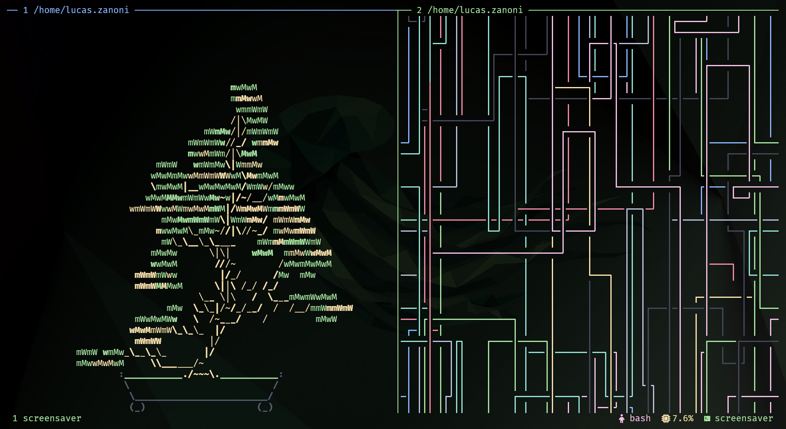
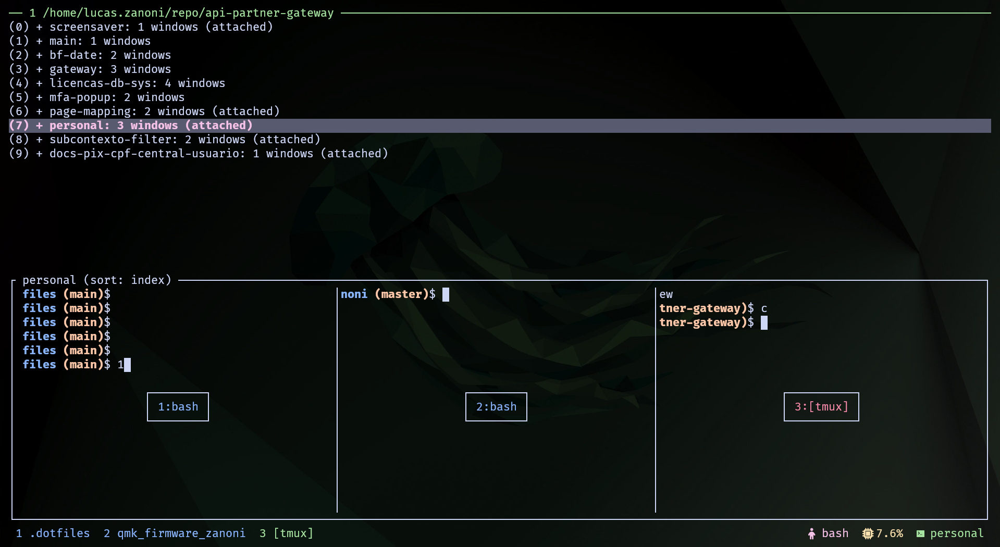
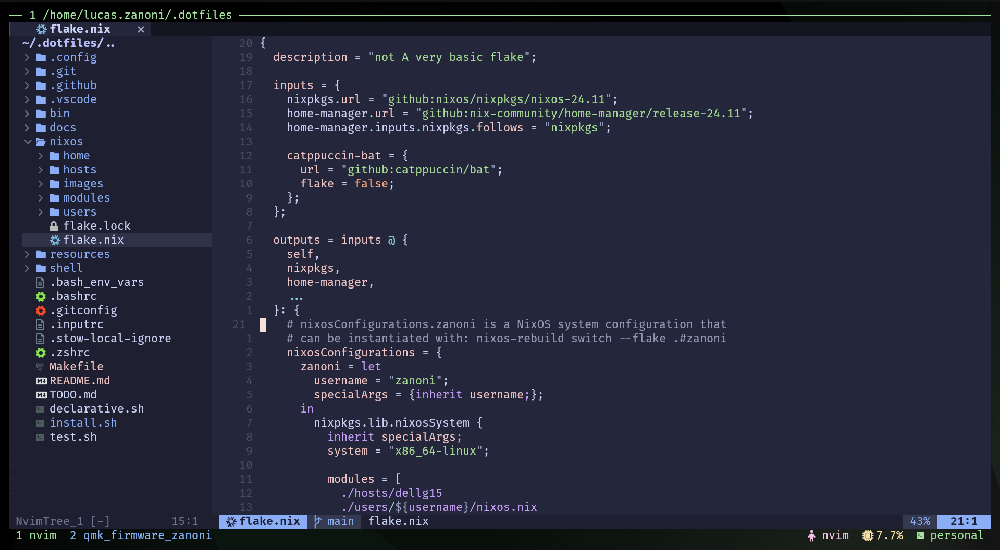
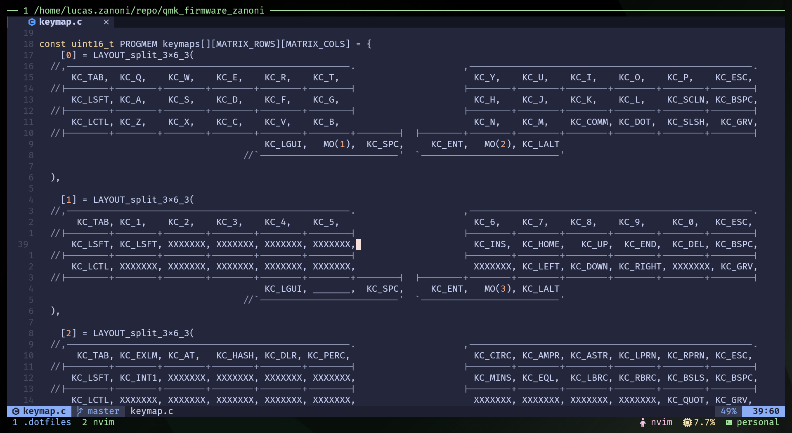

<h2 align="center">Zanoni's NixOS Desktop Config</h2>

<p align="center">
  
</p>

<p align="center">
   
   <a href="https://nixos.org/">
      
   </a>
   <a href="https://github.com/ryan4yin/nixos-and-flakes-book">
      
   </a>
</p>

This repository contains the setup for my development environment on both NixOS and Ubuntu. It includes scripts for installing necessary applications and configuring dotfiles to set up a new system interactively.

1. NixOS Laptop: NixOS with home-manager, hyprland, GNOME, etc.
2. Ubuntu Work Laptop: Custom scripts for installing applications and configuring dotfiles.

## Components

|                       | NixOS |
| --------------------- | -------------- |
| **Window Manager**    | Hyprland       |
| **Terminal Emulator** | Bash + Kitty   |


## Showcase: Hyprland + Bash + Kitty + Neovim 

TODO: add desktop video showcase
<!--  -->

### Hyprland
TODO: add screenshots

### Kitty ᓚᘏᗢ

<details>
<summary>🪟 Panes</summary>


</details>
<details>
<summary>🪴 Screensaver</summary>



</details>
<details>
<summary>🔱 Sessions</summary>



</details>

### Neovim

<details>
<summary>:wq Editor</summary>



</details>
<details>
<summary>🎯 Focused Editor</summary>



</details>

## NixOS Setup

### How to Deploy this Flake?

> To install nixos on your machine i recommend following the official guide on the nixos website: [nixos.org/download](https://nixos.org/download/)
> and going with the GNOME, 64-bit Intel/AMD option for ease of first-time setup.

I recommend going through /nixos/hosts and checking the configurations for the hosts that are already there for my dell g15 setup. You can use them as a reference for your own host machine setup.

And check out the /nixos/users to get a sense of the user configurations that are available, like my zanoni one.

Once you've checked those out and made the necessary changes, you can follow the steps below to deploy the flake.

Replace `dellg15` with the name of your custom host if needed.

- Generate the hardware configuration for your system:

```bash
   nixos-generate-config --dir nixos/hosts/configs/dellg15
```

this will generate a hardware-configuration.nix that nixos will use to configure your system based on the hardware it detects.

Replace `zanoni` with the name of your user if needed.

- Rebuild the system configuration using flakes:

```bash
   sudo nixos-rebuild switch --flake .#zanoni
```

and now you should have a system configured with the flake. Enjoy!

## Ubuntu Setup

The company I work for uses Ubuntu as the main operating system, so I have a setup for it as well. The setup is based on a script that installs applications and configures dotfiles. The script is interactive and guides you through the installation process.

> Make sure to clone this repo on your home directory before running the install script.
```bash
make install
```

### Flags and customization

| Config | Description                                                                                                                                                       |
| ------ | ----------------------------------------------------------------------------------------------------------------------------------------------------------------- |
| -d     | using this flag the install script will follow your settings in the [declarative.sh](./declarative.sh) file so you can install only the configs and pkgs you want |

## References

Dotfiles that inspired me:

- Nix Flakes
  - [ryan4yin/nix-config](https://github.com/ryan4yin/nix-config)
  - [OfflineBot/nixos](https://github.com/OfflineBot/nixos)

[Hyprland]: https://github.com/hyprwm/Hyprland
[Kitty]: https://github.com/kovidgoyal/kitty
[Neovim]: https://github.com/neovim/neovim
[Nerd fonts]: https://github.com/ryanoasis/nerd-fonts
[catppuccin]: https://github.com/catppuccin/catppuccin
[Yazi]: https://github.com/sxyazi/yazi
