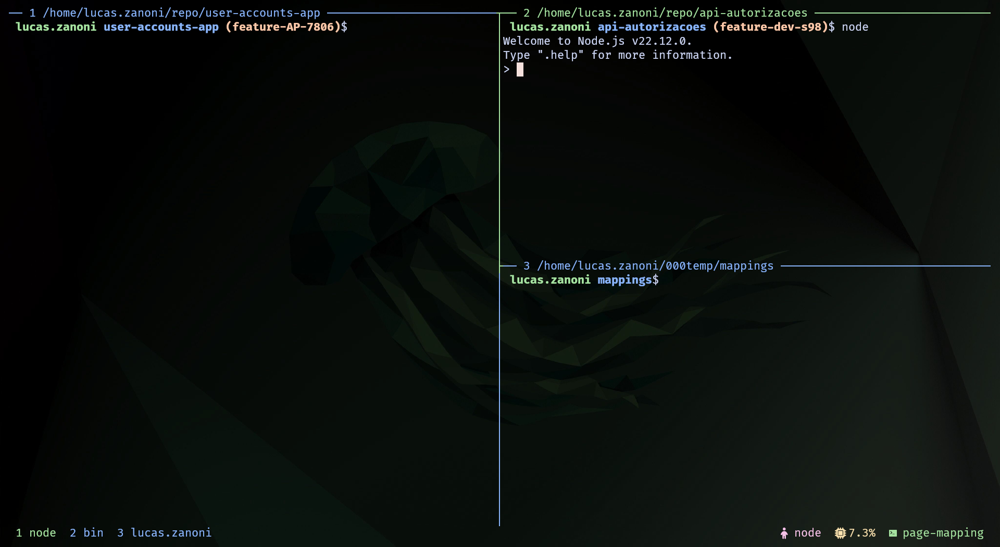
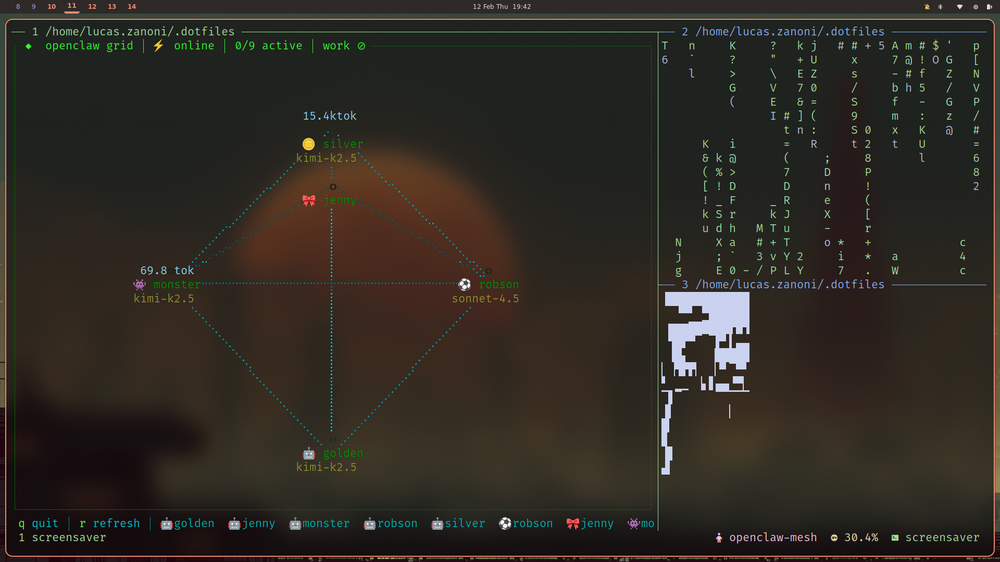
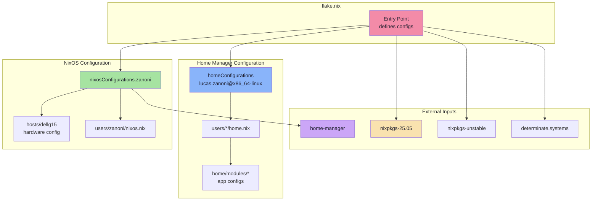

<h2 align="center">Zanoni's Desktop Configs</h2>

<p align="center">
  
</p>

<p align="center">
   
   <a href="https://nixos.org/">
      
   </a>
</p>

Welcome to my dotfiles! This repository contains my desktop environment setup for both **NixOS** and **Ubuntu**. It's built with Nix Flakes and Home Manager.

<!-- ## 🎬 Showcase: Hyprland + Bash/Fish + Kitty + Neovim  -->
<!-- TODO: add desktop video showcase -->
<!-- *(More screenshots & videos coming soon!)* -->

<!-- ### Hyprland -->
<!-- TODO: add screenshots -->
<!-- *Coming soon! Currently ricing with waybar and fuzzel* -->

### Kitty ᓚᘏᗢ + Tmux

<details>
<summary>🪟 Panes</summary>



</details>
<details>
<summary>🪴 Screensaver</summary>



</details>
<details>
<summary>🔱 Sessions</summary>


</details>

### Neovim

<details>
<summary>:wq Editor</summary>


</details>
<details>
<summary>🎯 Focused Editor</summary>


</details>

## 📂 Repository Structure - Relevant things

```
.dotfiles/
├── .bashrc              # Main shell configuration (i'm using fish with [bass](https://github.com/edc/bass))
├── .config/             # Application configs (hypr, kitty, tmux, nvim, etc.)
├── .shell_env_vars      # Local environment variables (git-ignored)
├── bin/                 # Custom shell scripts & utilities
├── home/                # Home Manager modules
├── hosts/               # NixOS host configurations
├── nixos/               # NixOS system modules
├── shell/               # Shell configurations (bash, fish, zsh)
├── static/              # Wallpapers, screenshots, and other assets
├── users/               # User-specific configurations
│   ├── lucas.zanoni/    # Home Manager standalone config (Ubuntu/non-NixOS)
│   └── zanoni/          # Full NixOS system config
├── flake.nix            # Nix Flakes entry point
├── flake.lock           # Locked dependencies
├── Makefile             # Helper commands
└── README.md            # This file!
```
---

## ⚙️ Quick Start for:

<details>
<summary>
   <!-- add snowflake emoji -->
   <h2><b> NixOS Users</b></h2>
</summary>

### The Declarative Way

Got NixOS? Perfect. Here's how to deploy this flake:

#### 1. Clone the Repository
```bash
cd ~
git clone https://github.com/castrozan/.dotfiles.git
cd .dotfiles
```

#### 2. Generate Hardware Configuration
Replace `your_host` with your machine's identifier (e.g., `dellg15`):
```bash
sudo nixos-generate-config --dir hosts/your_host/configs
```

#### 3. Customize Your Configuration
- Copy and modify a user directory from `users/` (use `zanoni` as template)
- Update `flake.nix` to add your configuration in `nixosConfigurations`

#### 4. Deploy the Flake
```bash
sudo nixos-rebuild switch --flake .#your_user
```

#### 5. Post-Deployment
- Restart your system (recommended)
- Enjoy your new setup! 🎉

</details>

---

<details>
<summary>
   <h2><b>🐧 Ubuntu/Non-NixOS Users</b></h2>
</summary>

### Home Manager Standalone

Don't have NixOS? No worries! You can still use Home Manager to manage your dotfiles:

#### 1. Clone the Repository
```bash
cd ~
git clone https://github.com/castrozan/.dotfiles.git
cd .dotfiles
```

#### 2. Install Nix (if not already installed)
```bash
curl -L https://nixos.org/nix/install | sh -s -- --daemon
```

#### 3. Deploy with Home Manager
```bash
# For the lucas.zanoni configuration (adjust username as needed)
nix run home-manager/release-25.05 -- --flake .#lucas.zanoni@x86_64-linux switch -b "backup-$(date +%Y-%m-%d-%H-%M-%S)"
```
</details>

---

<details>
<summary>
   <h2><b>🏗️ Architecture Overview</b></h2>
</summary>

Here's how everything fits together:



</details>

---

## 🔗 Inspiration & Credits

This setup is inspired by and borrows from:
- [ryan4yin/nix-config](https://github.com/ryan4yin/nix-config) - Excellent complex Nix configurations
- [OfflineBot/nixos](https://github.com/OfflineBot/nixos) - Clean NixOS setup
- The amazing NixOS and Home Manager communities
- And countless other dotfiles repos I've stumbled upon at 3 AM 🌙

## 📚 Resources

- [NixOS Manual](https://nixos.org/manual) - Official documentation
- [Home Manager Manual](https://nix-community.github.io/home-manager/) - Home Manager docs
- [Nix Pills](https://nixos.org/guides/nix-pills/) - Learn Nix the fun way
- [NixOS & Flakes Book](https://github.com/ryan4yin/nixos-and-flakes-book) - Comprehensive guide

---

Enjoy ricing and happy hacking! If you like this setup, consider giving it a ⭐