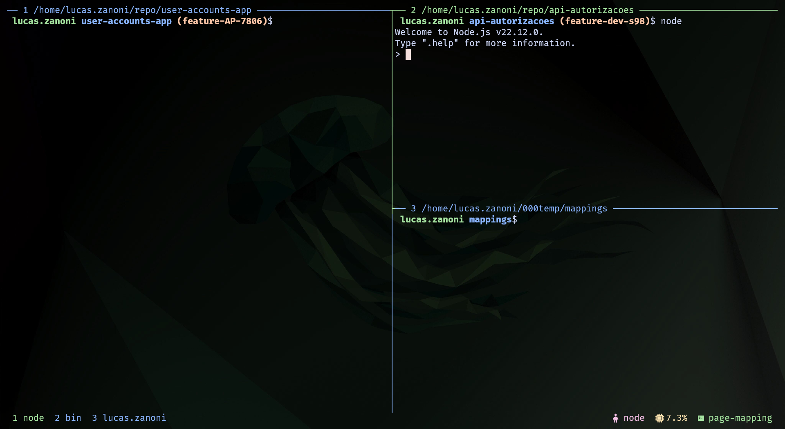
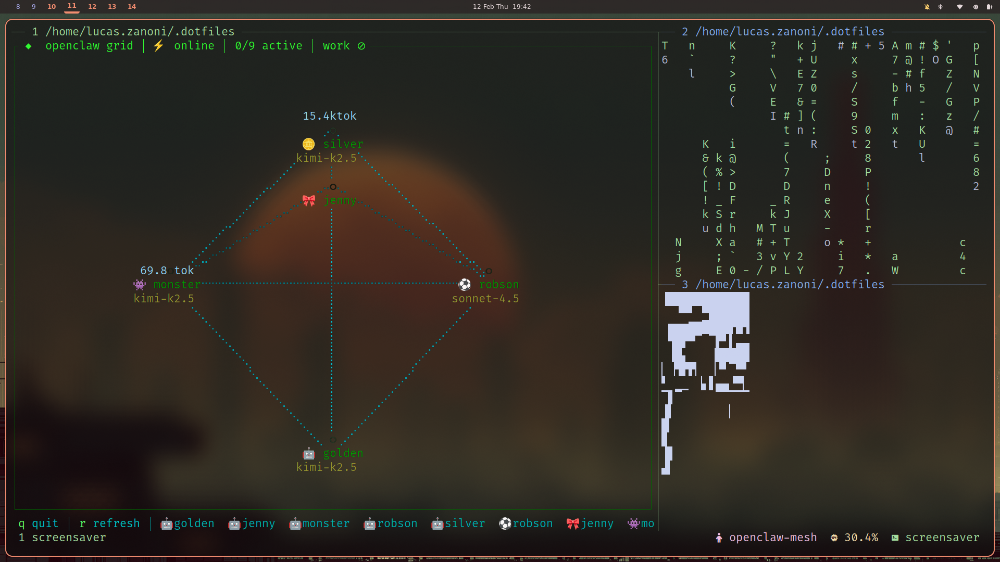
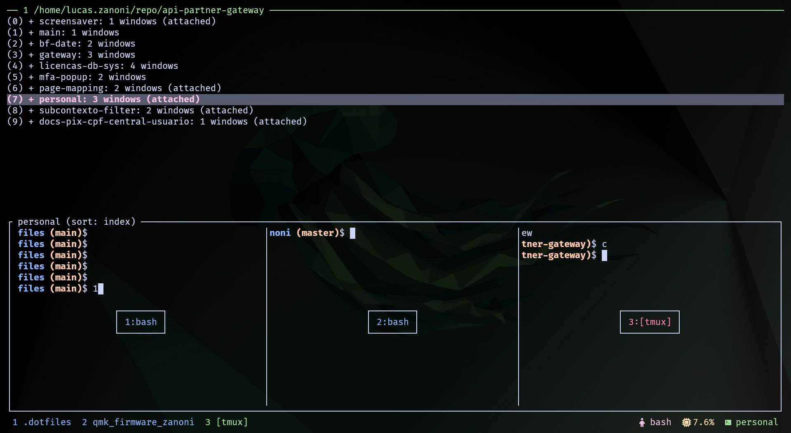
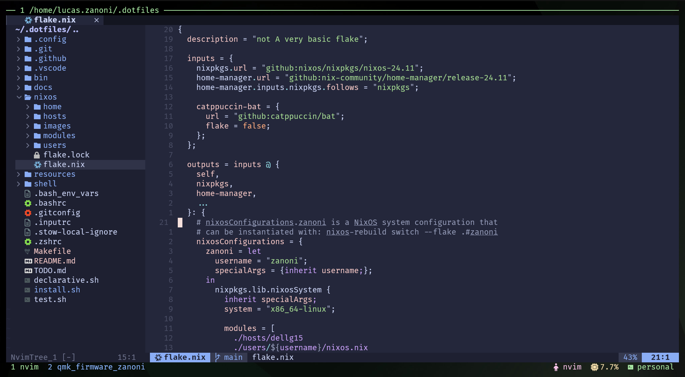
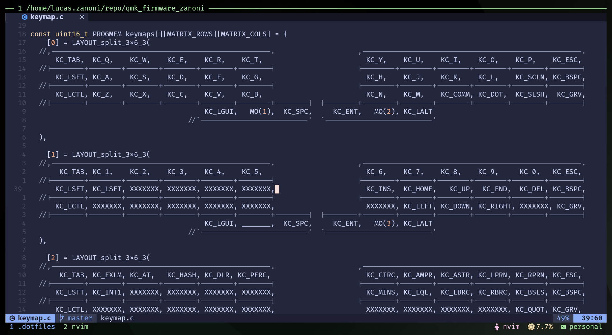
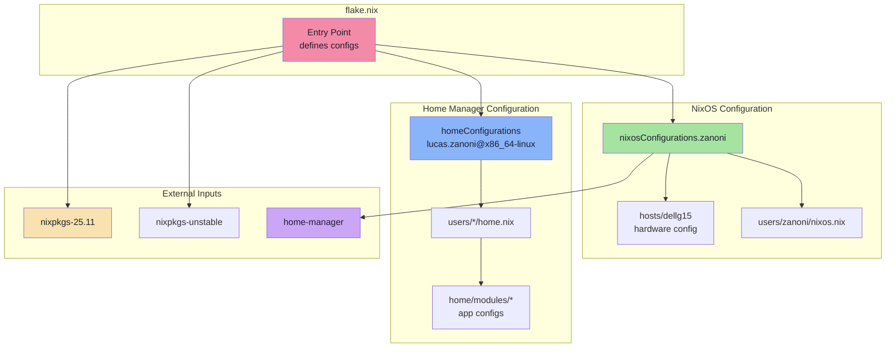

<h2 align="center"><a href="https://github.com/castrozan" target="_blank" rel="noopener noreferrer">Zanoni's</a> Desktop Configs</h2>

<p align="center">
  
</p>

<p align="center">
   <a href="https://github.com/Castrozan/.dotfiles/actions/workflows/tests.yml">
      
   </a>
   <a href="https://castrozan.github.io/.dotfiles/">
      
   </a>
   
   <a href="https://nixos.org/">
      
   </a>
</p>

Welcome to my dotfiles! This repository contains my desktop environment setup for both **NixOS** and **Ubuntu**. It's built with Nix Flakes and Home Manager.

https://github.com/user-attachments/assets/c5959f36-6b7a-450c-a18c-f430d60fcafc

## Desktop Showcase

### Kitty ᓚᘏᗢ + Tmux

<details>
<summary>🪟 Panes</summary>



</details>
<details>
<summary>🪴 Screensaver</summary>



</details>
<details>
<summary>🔱 Sessions</summary>



</details>

### Neovim

<details>
<summary>:wq Editor</summary>



</details>
<details>
<summary>🎯 Focused Editor</summary>



</details>

---

## Getting Started

### The Declarative Way

Got NixOS from the <a href="https://nixos.org/download.html" target="_blank" rel="noopener noreferrer">installer</a>? Perfect. Here's how to deploy this flake:

<details>
<summary>
   <b>Quick Start for: ❄️ NixOS Users</b>
</summary>

#### 1. Clone the Repository
```bash
cd ~
git clone https://github.com/castrozan/.dotfiles.git
cd .dotfiles
```

#### 2. Generate Hardware Configuration
Replace `your_host` with your machine's identifier (e.g., `dellg15`):
```bash
sudo nixos-generate-config --dir hosts/your_host/configs
```

#### 3. Customize Your Configuration
- Copy and modify a user directory from `users/` (use `zanoni` as template)
- Update `flake.nix` to add your configuration in `nixosConfigurations`

#### 4. Deploy the Flake
```bash
sudo nixos-rebuild switch --flake .#your_user
```

#### 5. Post-Deployment
- Restart your system (recommended)
- Enjoy your new setup! 🎉

</details>

---

### Home Manager Standalone

Don't wanna go full NixOS for now? No worries! You can still use the flake with Home Manager to manage your dotfiles:
<details>
<summary>
   <b>Quick Start for: 🐧 Ubuntu/Non-NixOS systems</b>
</summary>

#### 1. Clone the Repository
```bash
cd ~
git clone https://github.com/castrozan/.dotfiles.git
cd .dotfiles
```

#### 2. Install Nix (if not already installed)
```bash
curl -L https://nixos.org/nix/install | sh -s -- --daemon
```

#### 3. Deploy with Home Manager
```bash
# For the lucas.zanoni configuration (adjust username as needed)
nix run home-manager/release-25.11 -- --flake .#lucas.zanoni@x86_64-linux switch -b "backup-$(date +%Y-%m-%d-%H-%M-%S)"
```
</details>

---

## 🏗️ Architecture Overview

<details>
<summary>📦 mermaid</summary>

Here's how everything fits together:


```mermaid
graph TD
    subgraph "flake.nix"
        Flake["Entry Point<br/>defines configs"]
    end

    subgraph "NixOS Configuration"
        NixOS["nixosConfigurations.zanoni"]
        Host["hosts/dellg15<br/>hardware config"]
        UserNixOS["users/zanoni/nixos.nix"]
    end

    subgraph "Home Manager Configuration"
        HomeStandalone["homeConfigurations<br/>lucas.zanoni@x86_64-linux"]
        UserHome["users/*/home.nix"]
        Modules["home/modules/*<br/>app configs"]
    end

    subgraph "External Inputs"
        Nixpkgs["nixpkgs-25.11"]
        Unstable["nixpkgs-unstable"]
        HM["home-manager"]
    end

    Flake --> NixOS
    Flake --> HomeStandalone
    
    NixOS --> Host
    NixOS --> UserNixOS
    NixOS --> HM
    
    HomeStandalone --> UserHome
    UserHome --> Modules
    
    Flake --> Nixpkgs
    Flake --> Unstable

    style Flake fill:#f38ba8,color:#1e1e2e
    style NixOS fill:#a6e3a1,color:#1e1e2e
    style HomeStandalone fill:#89b4fa,color:#1e1e2e
    style Nixpkgs fill:#f9e2af,color:#1e1e2e
    style HM fill:#cba6f7,color:#1e1e2e
```

</details>

---

## 📂 Repository Structure

<details>
<summary>📂 Top-level structure</summary>

```
.dotfiles/
├── agents/              # Claude Code agent skills, hooks, and evaluations
│   ├── core.md          # Core agent behavior instructions (alwaysApply)
│   ├── skills/          # 13 umbrella skills (git, nix, session, browser, ...)
│   ├── hooks/           # Lifecycle hook scripts (format, lint, rebuild, review)
│   └── evals/           # Evaluation framework (baseline, e2e, integration)
├── flake/               # Flake infrastructure (home-manager module exports)
├── home/                # Home Manager shared modules
│   └── modules/         # Application and feature modules (see below)
├── hosts/               # NixOS host-specific configurations
│   └── dellg15/         # Dell G15 hardware config, scripts, tests
├── lib/                 # Nix utility functions (nixgl-wrap, fetch-prebuilt-binary)
├── nixos/               # NixOS system-level modules
│   └── modules/         # agenix, steam, virtualization, network, media-streaming...
├── secrets/             # Encrypted secrets (agenix): api-keys, bot-tokens, credentials
├── static/              # Static assets: wallpapers, documentation screenshots
├── tests/               # Test suite (bats, pytest, nix-checks)
├── users/
│   ├── lucas.zanoni/    # Home Manager standalone config (Ubuntu/non-NixOS)
│   └── zanoni/          # Full NixOS system config
├── flake.nix            # Nix Flakes entry point
├── Makefile             # Helper commands
└── README.md            # This file!
```
</details>

<details>
<summary>📦 home/modules/ - all application modules</summary>

| Module | Description |
|--------|-------------|
| `agents` | A2A MCP server integration |
| `audio` | PipeWire pipeline, Bluetooth policy, audio scripts |
| `browser` | Chrome, Firefox, global browser config, CDP tests |
| `claude` | Claude Code IDE: config, channels, skills, MCP servers, hooks, project agents |
| `codex` | Codex IDE configuration and patches |
| `cursor` | Cursor global user rules |
| `desktop` | Clipboard, screenshots, notifications, fonts, desktop utilities |
| `dev` | Git, GitHub Actions runner, K9s, MongoDB Compass, dev utilities |
| `editor` | Neovim, VSCode, Cursor, JetBrains IDEA |
| `gaming` | Vesktop, GOG CLI, bonsai, cmatrix, Nothing app |
| `gnome` | GTK, dconf, GNOME extensions |
| `home-assistant` | Home Assistant control scripts (AC, lights, scenes) |
| `hyprland` | Wayland compositor, Quickshell bar, window management, keybindings |
| `media` | MPD, MPV, codecs, streaming, audio/video utilities |
| `network` | OpenfortivVPN, FortiClient, DNS, shell completions |
| `ollama` | Ollama local LLM setup |
| `openclaw` | Multi-agent platform (Telegram/Discord), workspace, skills, reliability |
| `openclaw-mesh` | OpenClaw mesh networking |
| `opencode` | OpenCode IDE integration |
| `security` | Sophos monitor, keyrings, security scripts |
| `sourcebot` | Sourcebot skill integration |
| `system` | System utilities, sleep/suspend, hardware scripts |
| `terminal` | Fish shell, tmux config, screensaver, terminal utilities |
| `testing` | pytest, bats, test utilities |
| `voice` | Voice/speech recognition integration |

Each module follows the same pattern: `default.nix` as entry point, optional `scripts/` for Python/shell utilities, optional `tests/` for BATS/pytest suites, optional `docs/` for module-specific documentation.
</details>

<details>
<summary>🤖 agents/ - Claude Code skills, hooks, and evaluations</summary>

`agents/core.md` is loaded into every session (`alwaysApply: true`) and defines the authoritative agent behavior rules (code style, git discipline, tool preferences, workflow, etc.).

### Skills (`agents/skills/`)

Skills are organized as umbrella directories. Each umbrella has a `SKILL.md` (the skill the agent can invoke) plus sub-skill `.md` files and optional `scripts/`, `evals/`, and Nix wiring.

| Skill | Description |
|-------|-------------|
| `browser` | Live browser automation - fill forms, click buttons, test web UI, capture screenshots |
| `comms` | Discord bot, Twitter/X CLI, social channel integration |
| `desktop` | Desktop automation, media control, MPRIS players, clipboard, screenshots |
| `git` | Commits, staging, commit message quality, history search |
| `nix` | Nix language, module system, flakes, rebuild, devenv, Docker |
| `openclaw` | Multi-agent platform: A2A, grid, Telegram/Discord bots, cron |
| `personal` | Personal channels: Gmail, Calendar, WhatsApp, Obsidian, Home Assistant, ponto |
| `phone-status` | Phone battery and status via SSH |
| `quickshell` | Quickshell bar/OSD/switcher - QML editing, IPC, visual verification |
| `research` | Current-information research, tool comparisons, external synthesis |
| `review` | Code review rubric, compliance auditing, documentation, skill authoring |
| `session` | Session lifecycle, deep work, worktrees, tmux, Claude Code instances |
| `test` | Testing methodology and verification workflow |

### Hooks (`agents/hooks/`)

Python scripts wired as Claude Code lifecycle hooks:

| Hook | Trigger |
|------|---------|
| `auto-format.py` | After editing - runs ruff, nixfmt, shfmt |
| `lint-on-edit.py` | On file edit - runs language-appropriate linter |
| `nix-rebuild-trigger.py` | After editing `.nix` files - queues rebuild |
| `core-instruction-reinforcement.py` | Session start - injects core rules |
| `deep-work-recovery.py` | Session start - resumes active deep-work context |
| `session-context.py` | Session start - injects workspace/git/env context |
| `workspace-directory-injector.py` | Session start - sets working directory |
| `end-of-work-compliance-review.py` | Task completed - spawns parallel reviewers |
| `task-completed-quality-gate.py` | Task completed - quality gate before responding |
| `teammate-idle-quality-gate.py` | Teammate idle - reviews subagent output |
| `pre-push-ci-gate.py` | Pre-push - runs CI checks before git push |
| `url-to-skill-router.py` | On URL input - routes to matching skill |
| `run-hook.sh` | Shell wrapper for hook execution |

### Evals (`agents/evals/`)

Evaluation infrastructure for measuring agent behavior quality:

- `run-evals.py` - Eval runner (batch, single, or filter by tag)
- `baseline.json` - Saved baseline scores (92.8%, 192/207 scenarios)
- `config/` - Eval configuration per skill/scenario set
- `e2e/` - End-to-end scenarios (35 total: 13 behavior, 12 skill-discovery-leading, 10 skill-discovery-natural)
- `integration/` - Integration-level behavior tests
- `validate-skill-frontmatter.sh` - Validates all SKILL.md have required fields

</details>

---

## 🔗 Inspiration & Credits

This setup is inspired by and borrows from:
- <a href="https://github.com/ryan4yin/nix-config" target="_blank" rel="noopener noreferrer">ryan4yin/nix-config</a> - Excellent complex Nix configurations
- <a href="https://github.com/OfflineBot/nixos" target="_blank" rel="noopener noreferrer">OfflineBot/nixos</a> - Clean NixOS setup
- The amazing NixOS and Home Manager communities
- And countless other dotfiles repos I've stumbled upon at 3 AM 🌙

## 📚 Resources

- <a href="https://nixos.org/manual" target="_blank" rel="noopener noreferrer">NixOS Manual</a> - Official documentation
- <a href="https://nix-community.github.io/home-manager/" target="_blank" rel="noopener noreferrer">Home Manager Manual</a> - Home Manager docs
- <a href="https://nixos.org/guides/nix-pills/" target="_blank" rel="noopener noreferrer">Nix Pills</a> - Learn Nix the fun way
- <a href="https://github.com/ryan4yin/nixos-and-flakes-book" target="_blank" rel="noopener noreferrer">NixOS & Flakes Book</a> - Comprehensive guide

---

Enjoy ricing and happy hacking! If you like this setup, consider giving it a ⭐