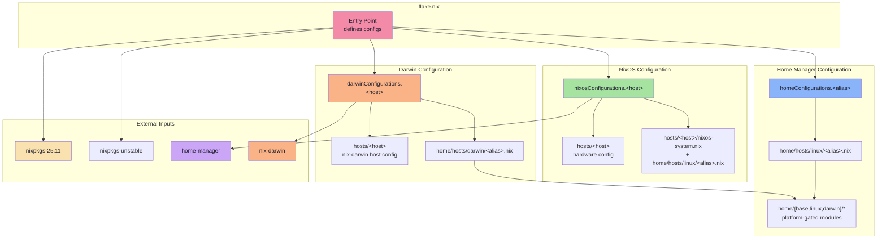

<h2 align="center"><a href="https://github.com/castrozan" target="_blank" rel="noopener noreferrer">Zanoni's</a> Desktop Configs</h2>

<p align="center">
  
</p>

<p align="center">
   <a href="https://github.com/Castrozan/.dotfiles/actions/workflows/tests.yml">
      
   </a>
   <a href="https://castrozan.github.io/.dotfiles/">
      
   </a>
   
   <a href="https://nixos.org/">
      
   </a>
</p>

Welcome to my dotfiles! This repository contains my desktop environment setup for both **NixOS** and **Ubuntu**. It's built with Nix Flakes and Home Manager.

https://github.com/user-attachments/assets/c5959f36-6b7a-450c-a18c-f430d60fcafc

## Desktop Showcase

### Kitty ᓚᘏᗢ + Tmux

<details>
<summary>🪟 Panes</summary>


</details>
<details>
<summary>🪴 Screensaver</summary>


</details>
<details>
<summary>🔱 Sessions</summary>


</details>

### Neovim

<details>
<summary>:wq Editor</summary>


</details>
<details>
<summary>🎯 Focused Editor</summary>


</details>

---

## Getting Started

### The Declarative Way

Got NixOS from the <a href="https://nixos.org/download.html" target="_blank" rel="noopener noreferrer">installer</a>? Perfect. Here's how to deploy this flake:

<details>
<summary>
   <b>Quick Start for: ❄️ NixOS Users</b>
</summary>

#### 1. Clone the Repository
```bash
cd ~
git clone https://github.com/castrozan/.dotfiles.git
cd .dotfiles
```

#### 2. Generate Hardware Configuration
Replace `your_host` with your machine's identifier (e.g., `chise`):
```bash
sudo nixos-generate-config --dir hosts/your_host/configs
```

#### 3. Customize Your Configuration
- Copy and adapt the existing host setup: `hosts/chise/` (system config) and `home/hosts/linux/chise.nix` plus `home/hosts/linux/chise/` (per-user home-manager modules) as templates
- Update `flake/nixos-configurations.nix` to register your machine alias under `nixosConfigurations`

#### 4. Deploy the Flake
```bash
sudo nixos-rebuild switch --flake .#your_user
```

#### 5. Post-Deployment
- Restart your system (recommended)
- Enjoy your new setup! 🎉

</details>

---

### Home Manager Standalone

Don't wanna go full NixOS for now? No worries! You can still use the flake with Home Manager to manage your dotfiles:
<details>
<summary>
   <b>Quick Start for: 🐧 Ubuntu/Non-NixOS systems</b>
</summary>

#### 1. Clone the Repository
```bash
cd ~
git clone https://github.com/castrozan/.dotfiles.git
cd .dotfiles
```

#### 2. Install Nix (if not already installed)
```bash
curl -L https://nixos.org/nix/install | sh -s -- --daemon
```

#### 3. Deploy with Home Manager
```bash
# For the lucas.zanoni configuration (adjust username as needed)
nix run home-manager/release-25.11 -- --flake .#jojo switch -b "backup-$(date +%Y-%m-%d-%H-%M-%S)"
```
</details>

---

## 🏗️ Architecture Overview

<details>
<summary>📦 mermaid</summary>

Here's how everything fits together:


```mermaid
graph TD
    subgraph "flake.nix"
        Flake["Entry Point<br/>defines configs"]
    end

    subgraph "NixOS Configuration"
        NixOS["nixosConfigurations.&lt;host&gt;"]
        Host["hosts/&lt;host&gt;<br/>hardware config"]
        UserNixOS["hosts/&lt;host&gt;/nixos-system.nix<br/>+ home/hosts/linux/&lt;alias&gt;.nix"]
    end

    subgraph "Darwin Configuration"
        Darwin["darwinConfigurations.&lt;host&gt;"]
        DarwinHost["hosts/&lt;host&gt;<br/>nix-darwin host config"]
        DarwinHome["home/hosts/darwin/&lt;alias&gt;.nix"]
    end

    subgraph "Home Manager Configuration"
        HomeStandalone["homeConfigurations.&lt;alias&gt;"]
        UserHome["home/hosts/linux/&lt;alias&gt;.nix"]
        Modules["home/{base,linux,darwin}/*<br/>platform-gated modules"]
    end

    subgraph "External Inputs"
        Nixpkgs["nixpkgs-25.11"]
        Unstable["nixpkgs-unstable"]
        HM["home-manager"]
        ND["nix-darwin"]
    end

    Flake --> NixOS
    Flake --> Darwin
    Flake --> HomeStandalone

    NixOS --> Host
    NixOS --> UserNixOS
    NixOS --> HM

    Darwin --> DarwinHost
    Darwin --> DarwinHome
    Darwin --> ND

    HomeStandalone --> UserHome
    UserHome --> Modules
    DarwinHome --> Modules
    
    Flake --> Nixpkgs
    Flake --> Unstable

    style Flake fill:#f38ba8,color:#1e1e2e
    style NixOS fill:#a6e3a1,color:#1e1e2e
    style Darwin fill:#fab387,color:#1e1e2e
    style HomeStandalone fill:#89b4fa,color:#1e1e2e
    style Nixpkgs fill:#f9e2af,color:#1e1e2e
    style HM fill:#cba6f7,color:#1e1e2e
    style ND fill:#fab387,color:#1e1e2e
```

</details>

---

## 📂 Repository Layout

Flake inputs live in `flake.nix`; outputs are split into `flake/{outputs,nixos-configurations,darwin-configurations,home-manager-modules}.nix`. Each output factory enumerates the hosts it owns and threads `hostname` plus `isNixOS` / `isDarwin` flags into `extraSpecialArgs`.

Home Manager modules under `home/` are split by platform, ryan4yin-style: `home/base/` (any-platform), `home/linux/`, `home/darwin/`. Per-platform subtrees let Linux-only modules never load on darwin and vice versa. Each module owns its `default.nix`, optional `scripts/`, optional `tests/`.

System-level host configs live in `hosts/<host>/`; reusable NixOS modules live in `nixos/modules/`. Each machine's home-manager entry point is `home/hosts/{linux,darwin}/<alias>.nix` (ryan4yin-style); host-only home modules can sit beside it in `home/hosts/{linux,darwin}/<alias>/`. Per-user shared bits live in `home/base/` (e.g. `home/base/packages/lucas-zanoni.nix`). Routers at `home/base/dev/git-private.nix` and `home/base/network/ssh-private.nix` look up `private-config/machines/${hostname}/<file>` so per-machine overrides land automatically when the file exists.

Private, machine-specific configuration (work emails, gitlab hosts, company skills) lives in the `private-config/` submodule under `private-config/machines/<hostname>/`. Encrypted secrets live in `secrets/` (agenix). Static assets in `static/`. The Claude Code agent system lives in `agents/` with `core.md` always applied and skills/hooks/evals as siblings; `agents/skills/<name>/SKILL.md` is the convention.

---

## 🔗 Inspiration & Credits

This setup is inspired by and borrows from:
- <a href="https://github.com/ryan4yin/nix-config" target="_blank" rel="noopener noreferrer">ryan4yin/nix-config</a> - Excellent complex Nix configurations
- <a href="https://github.com/OfflineBot/nixos" target="_blank" rel="noopener noreferrer">OfflineBot/nixos</a> - Clean NixOS setup
- The amazing NixOS and Home Manager communities
- And countless other dotfiles repos I've stumbled upon at 3 AM 🌙

## 📚 Resources

- <a href="https://nixos.org/manual" target="_blank" rel="noopener noreferrer">NixOS Manual</a> - Official documentation
- <a href="https://nix-community.github.io/home-manager/" target="_blank" rel="noopener noreferrer">Home Manager Manual</a> - Home Manager docs
- <a href="https://nixos.org/guides/nix-pills/" target="_blank" rel="noopener noreferrer">Nix Pills</a> - Learn Nix the fun way
- <a href="https://github.com/ryan4yin/nixos-and-flakes-book" target="_blank" rel="noopener noreferrer">NixOS & Flakes Book</a> - Comprehensive guide

---

Enjoy ricing and happy hacking! If you like this setup, consider giving it a ⭐