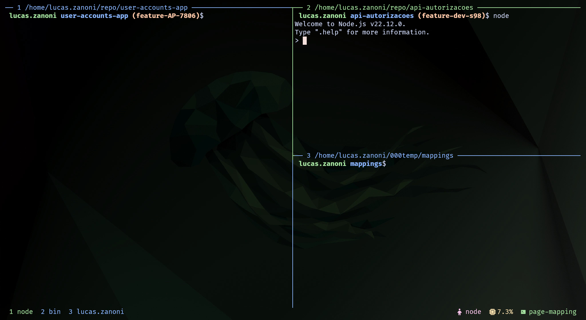
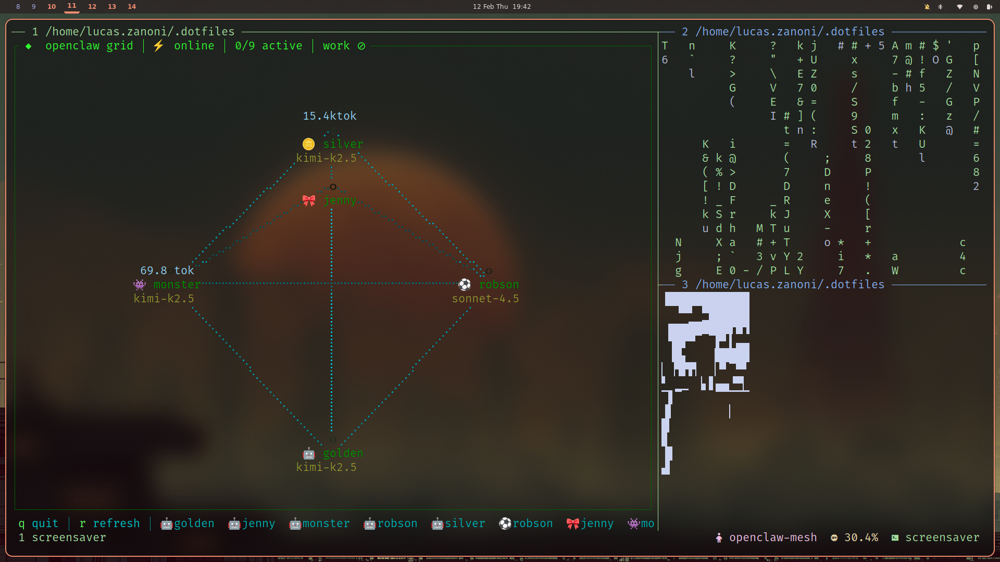
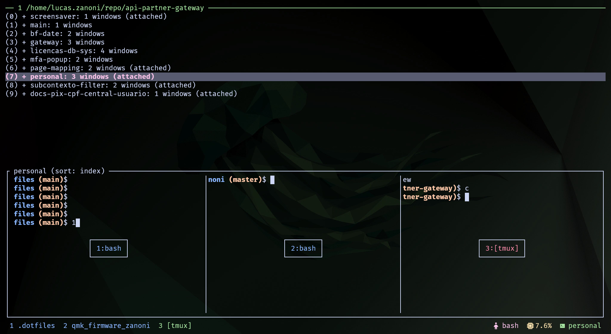
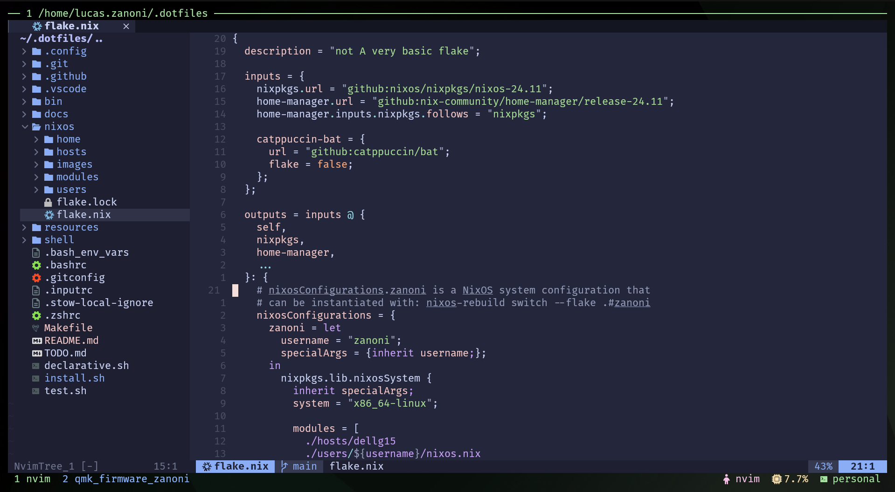
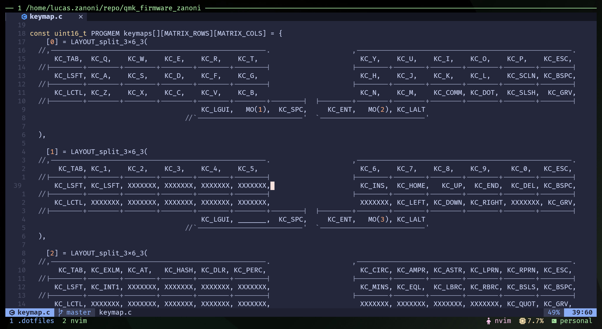
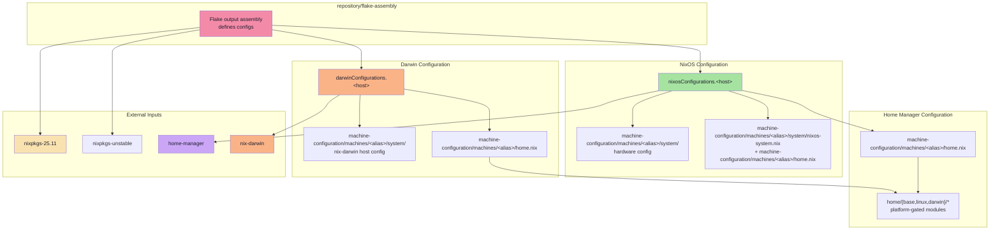

<h2 align="center"><a href="https://github.com/castrozan" target="_blank" rel="noopener noreferrer">Zanoni's</a> Desktop Configs</h2>

<p align="center">
  
</p>

<p align="center">
   <a href="https://github.com/Castrozan/.dotfiles/actions/workflows/tests.yml">
      
   </a>
   <a href="https://castrozan.github.io/.dotfiles/">
      
   </a>
   
   <a href="https://nixos.org/">
      
   </a>
</p>

Welcome to my dotfiles! This repository contains my desktop environment setup for **NixOS** and **macOS** under one flake. Built with Nix Flakes, Home Manager, and nix-darwin.

https://github.com/user-attachments/assets/c5959f36-6b7a-450c-a18c-f430d60fcafc

## Desktop Showcase

### Kitty ᓚᘏᗢ + Tmux

<details>
<summary>🪟 Panes</summary>



</details>
<details>
<summary>🪴 Screensaver</summary>



</details>
<details>
<summary>🔱 Sessions</summary>



</details>

### Neovim

<details>
<summary>:wq Editor</summary>



</details>
<details>
<summary>🎯 Focused Editor</summary>



</details>

---

## Getting Started

### The Declarative Way

Got NixOS from the <a href="https://nixos.org/download.html" target="_blank" rel="noopener noreferrer">installer</a>? Perfect. Here's how to deploy this flake:

<details>
<summary>
   <b>Quick Start for: ❄️ NixOS Users</b>
</summary>

#### 1. Clone the Repository
```bash
cd ~
git clone https://github.com/castrozan/.dotfiles.git
cd .dotfiles
```

#### 2. Generate Hardware Configuration
Pick a short alias for the machine (this repo uses anime names: `chise`, `rin`, `kira`). Then:
```bash
sudo nixos-generate-config --dir machine-configuration/machines/<alias>/system/configs
```

#### 3. Customize Your Configuration
- Copy `machine-configuration/machines/chise/system/` (system config) and `machine-configuration/machines/chise/home.nix` plus `machine-configuration/machines/chise/home/` (per-user home-manager modules) as templates for the new alias
- Update `repository/flake-assembly/nixos-configurations.nix` to register `nixosConfigurations.<alias>`

#### 4. Deploy the Flake
```bash
sudo nixos-rebuild switch --flake .?submodules=1#<alias>
```

#### 5. Post-Deployment
- Restart your system (recommended)
- Enjoy your new setup! 🎉

</details>

---

### macOS (nix-darwin)

For macOS, the flake composes nix-darwin with home-manager:
<details>
<summary>
   <b>Quick Start for: 🍎 macOS</b>
</summary>

#### 1. Install Nix + nix-darwin
```bash
sh <(curl -L https://nixos.org/nix/install)
nix run nix-darwin -- switch --flake .?submodules=1#<alias>
```

#### 2. Activate later rebuilds
```bash
sudo darwin-rebuild switch --flake .?submodules=1#<alias>
```
Use the host's alias (`rin`, `kira`, ...). The WezTerm cask is declared in `machine-configuration/terminal/emulators/wezterm/wezterm-nix-darwin.nix`.

</details>
</details>

---

## 🏗️ Architecture Overview

<details>
<summary>📦 mermaid</summary>

Here's how everything fits together:


```mermaid
graph TD
    subgraph "repository/flake-assembly"
        Flake["Flake output assembly<br/>defines configs"]
    end

    subgraph "NixOS Configuration"
        NixOS["nixosConfigurations.&lt;host&gt;"]
        Host["machine-configuration/machines/&lt;alias&gt;/system/<br/>hardware config"]
        UserNixOS["machine-configuration/machines/&lt;alias&gt;/system/nixos-system.nix<br/>+ machine-configuration/machines/&lt;alias&gt;/home.nix"]
    end

    subgraph "Darwin Configuration"
        Darwin["darwinConfigurations.&lt;host&gt;"]
        DarwinHost["machine-configuration/machines/&lt;alias&gt;/system/<br/>nix-darwin host config"]
        DarwinHome["machine-configuration/machines/&lt;alias&gt;/home.nix"]
    end

    subgraph "Home Manager Configuration"
        UserHome["machine-configuration/machines/&lt;alias&gt;/home.nix"]
        Modules["home/{base,linux,darwin}/*<br/>platform-gated modules"]
    end

    subgraph "External Inputs"
        Nixpkgs["nixpkgs-25.11"]
        Unstable["nixpkgs-unstable"]
        HM["home-manager"]
        ND["nix-darwin"]
    end

    Flake --> NixOS
    Flake --> Darwin

    NixOS --> Host
    NixOS --> UserNixOS
    NixOS --> HM

    Darwin --> DarwinHost
    Darwin --> DarwinHome
    Darwin --> ND

    NixOS --> UserHome
    UserHome --> Modules
    DarwinHome --> Modules
    
    Flake --> Nixpkgs
    Flake --> Unstable

    style Flake fill:#f38ba8,color:#1e1e2e
    style NixOS fill:#a6e3a1,color:#1e1e2e
    style Darwin fill:#fab387,color:#1e1e2e
    style Nixpkgs fill:#f9e2af,color:#1e1e2e
    style HM fill:#cba6f7,color:#1e1e2e
    style ND fill:#fab387,color:#1e1e2e
```

</details>

---

## 📂 Repository Layout

Flake inputs live in `flake.nix`; outputs are split into `repository/flake-assembly/{outputs,nixos-configurations,darwin-configurations,home-manager-modules}.nix`. Each output factory enumerates the hosts it owns and threads `hostname` plus `isNixOS` / `isDarwin` flags into `extraSpecialArgs`.

Capabilities live under `machine-configuration/` grouped by what they do, and each capability owns its Nix modules, raw configuration, `scripts/`, and `__tests__/` together. Deployment mechanism and platform appear in the file name (`-home-manager.nix`, `-nixos.nix`, `-nix-darwin.nix`), never as a directory level, so a capability implemented differently on each platform still reads as one place. The Home Manager entry points that compose those capabilities for the two macOS hosts are `machine-configuration/machines/shared-darwin-home-manager.nix` and `machine-configuration/machines/shared-darwin-system-nix-darwin.nix`. What has not migrated yet still sits under `home/base/`, `home/linux/`, and `nixos/modules/`.

Machine-specific system configuration lives in `machine-configuration/machines/<alias>/system/`; reusable NixOS modules live in `nixos/modules/`. Each machine's home-manager entry point is `machine-configuration/machines/<alias>/home.nix` (ryan4yin-style); host-only home modules live in `machine-configuration/machines/<alias>/home/`. Per-user shared bits live in `home/base/` (e.g. `home/base/packages/lucas-zanoni.nix`). Routers at `machine-configuration/development/version-control/git-private-home-manager.nix` and `home/base/network/ssh-private.nix` look up `private-config/machines/${hostname}/<file>` so per-machine overrides land automatically when the file exists.

Private, machine-specific configuration (work emails, gitlab hosts, company skills) lives in the `private-config/` submodule under `private-config/machines/<hostname>/`. Encrypted secrets live in `secrets/` (agenix). Static assets in `static/`. Agent instructions and shared skills live in `agent-harness/agent-instructions/`; the skill convention is `agent-harness/agent-instructions/skills/<name>/SKILL.md`. Hooks live in `agent-harness/hooks/`; evaluations live in `agent-harness/quality/evaluations/`.

---

## 🔗 Inspiration & Credits

This setup is inspired by and borrows from:
- <a href="https://github.com/ryan4yin/nix-config" target="_blank" rel="noopener noreferrer">ryan4yin/nix-config</a> - Excellent complex Nix configurations
- <a href="https://github.com/OfflineBot/nixos" target="_blank" rel="noopener noreferrer">OfflineBot/nixos</a> - Clean NixOS setup
- The amazing NixOS and Home Manager communities
- And countless other dotfiles repos I've stumbled upon at 3 AM 🌙

## 📚 Resources

- <a href="https://nixos.org/manual" target="_blank" rel="noopener noreferrer">NixOS Manual</a> - Official documentation
- <a href="https://nix-community.github.io/home-manager/" target="_blank" rel="noopener noreferrer">Home Manager Manual</a> - Home Manager docs
- <a href="https://nixos.org/guides/nix-pills/" target="_blank" rel="noopener noreferrer">Nix Pills</a> - Learn Nix the fun way
- <a href="https://github.com/ryan4yin/nixos-and-flakes-book" target="_blank" rel="noopener noreferrer">NixOS & Flakes Book</a> - Comprehensive guide

---

Enjoy ricing and happy hacking! If you like this setup, consider giving it a ⭐