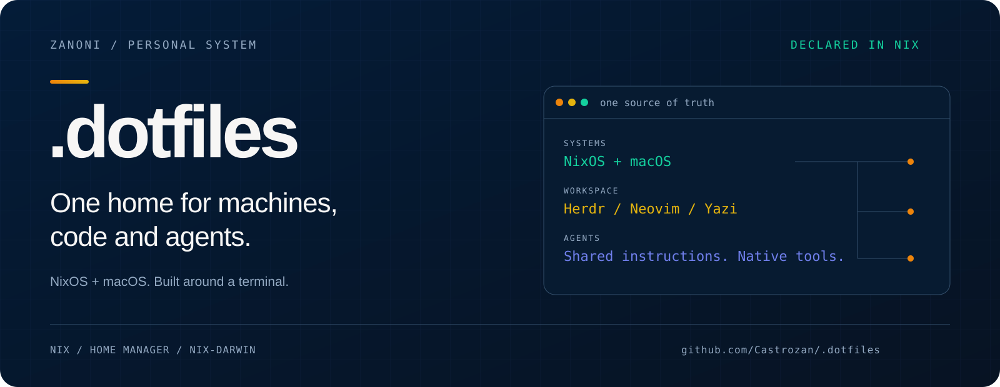
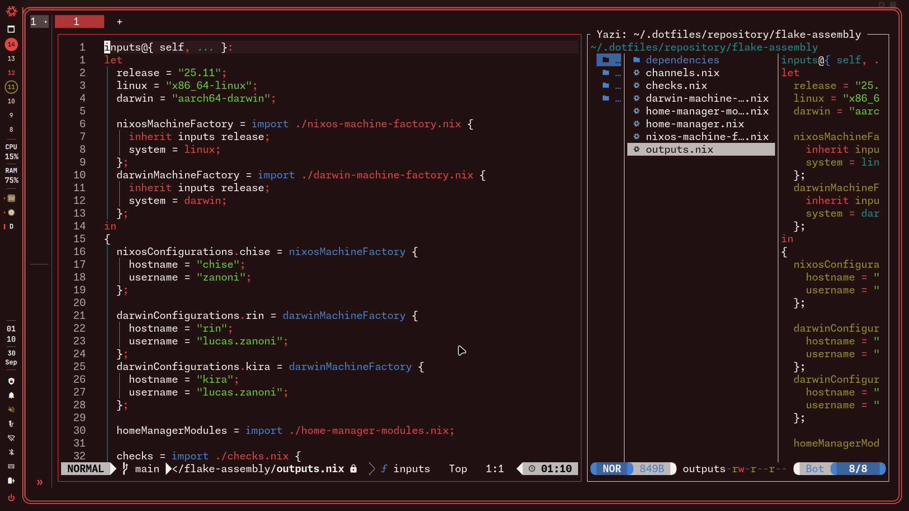
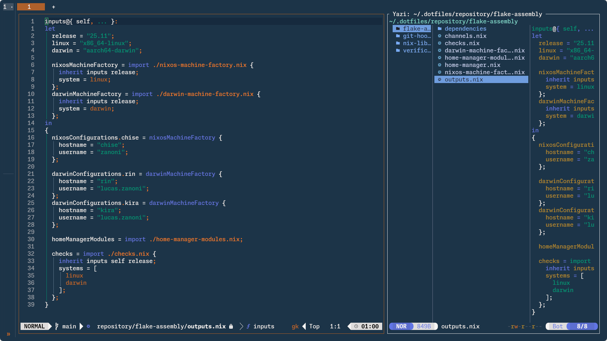
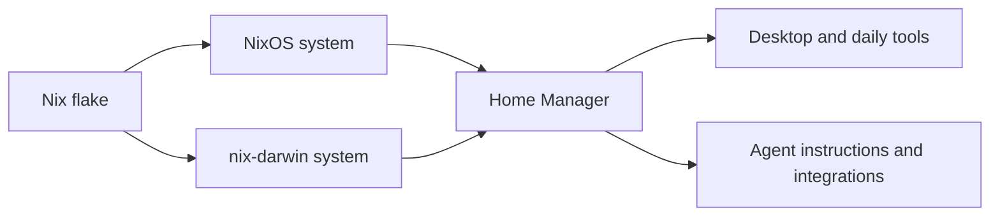

<p align="center">
  
</p>

<p align="center">
  <a href="#take-the-tour">Tour</a> ·
  <a href="#the-desktop">Desktop</a> ·
  <a href="#the-agents">Agents</a> ·
  <a href="#one-source-of-truth">Architecture</a> ·
  <a href="#make-it-yours">Make it yours</a> ·
  <a href="https://github.com/Castrozan/.dotfiles/actions/workflows/tests.yml">CI</a>
</p>

My personal computing environment, declared with **Nix**, **Home Manager** and **nix-darwin**. Linux and macOS share the tools I use every day: a terminal workspace, an editor, a theme and an agent harness. Host modules supply what each machine needs.

## Take the tour

https://github.com/user-attachments/assets/f94d678e-3fcb-442c-b6fc-64b2e13f9602

An animated tour of the Linux and macOS desktops, shared modules and configuration workflow.

## The desktop

**NixOS / Hyprland** and **macOS / Hammerspoon**, with WezTerm, [Herdr](https://github.com/Castrozan/herdr), Neovim and Yazi at the center of the workflow. Herdr keeps terminal workspaces and agent sessions together; the shared appearance modules carry the theme across applications.

<p>
  <a href="repository/showcase/linux.png"></a>
  <a href="repository/showcase/macos.png"></a>
</p>

<p align="center"><sub>NixOS on the left, macOS on the right. Open either image for the full capture.</sub></p>

The [terminal modules](machine-configuration/terminal), [Neovim configuration](machine-configuration/editors/neovim) and [appearance modules](machine-configuration/desktop/appearance) own the setup shown here. Desktop automation is declared in the [Hyprland](machine-configuration/desktop/desktop-environments/hyprland) and [Hammerspoon](machine-configuration/desktop/hammerspoon) modules.

## The agents

**Claude Code, Codex, OpenCode, Pi and Hermes** share a maintained set of instructions and skills. Each harness receives the settings, hooks and integrations it supports. [Clawde](agent-harness/harnesses/clawde) adds persistent agents and supervision; a per-machine steward keeps this repository synchronized and verified.

The harness includes:

- **Shared skills and MCP integrations** distributed through a common production plugin.
- **Session control and agent communication** for continuing work and coordinating across harnesses and machines.
- **Servant identities** that give each session a character while preserving its technical responsibilities.
- **Behavioral evaluations and package checks** that test instructions and the artifacts delivered to each harness.

Start with the [shared instruction deployment](agent-harness/agent-instructions/agent-instructions-home-manager.nix), [harness modules](agent-harness/harnesses) or [evaluation suite](agent-harness/quality/evaluations).

## One source of truth


```mermaid
flowchart LR
    Flake["Nix flake"] --> NixOS["NixOS system"]
    Flake --> Darwin["nix-darwin system"]
    NixOS --> Home["Home Manager"]
    Darwin --> Home
    Home --> Desktop["Desktop and daily tools"]
    Home --> Agents["Agent instructions and integrations"]
```

Reusable modules are organized by capability. Machine entry points compose them, with platform guards for Linux and macOS. A configuration change belongs in its module; `rebuild` materializes it on the machine.

[Host outputs](repository/flake-assembly/outputs.nix) explicitly select each machine. The [dependencies flake](repository/flake-assembly/dependencies/flake.nix) owns upstream inputs; the root [flake](flake.nix) assembles them. Private configuration and encrypted secrets have separate ownership boundaries.

## Make it yours

This is a personal configuration, not an installer. The host declarations, hardware settings, user names and private dependencies belong to my machines. Borrow a module or adapt a host before activating it.

```sh
git clone https://github.com/Castrozan/.dotfiles.git
cd .dotfiles
```

For a new machine, adapt a [host configuration](machine-configuration/machines) and register it in the [host outputs](repository/flake-assembly/outputs.nix). Review the [private dependencies](repository/flake-assembly/dependencies/flake.nix) and [private submodule](.gitmodules): a public clone does not grant access to either private repository.

Follow the upstream [NixOS](https://nixos.org/manual/nixos/stable/#sec-flakes) or [nix-darwin](https://github.com/nix-darwin/nix-darwin#installing) activation procedure for your platform. [Home Manager](https://nix-community.github.io/home-manager/) documents the user-level modules.

On an already configured machine:

```sh
rebuild
```

## Verification

Scripts and integrations have tests beside their owning modules. [CI](https://github.com/Castrozan/.dotfiles/actions) runs behavioral tests, validates Nix configuration and checks the emitted agent package. The [quality overview](agent-harness/measurement-and-reporting/quality-overview/README.md) explains exactly what its evidence establishes.

The development loop is a local rebuild and live verification, followed by a push and green CI. The [repository instructions](AGENTS.md) define that workflow.

## Credits

Built on NixOS, nix-darwin, Home Manager and the work of their communities. Early inspiration came from [ryan4yin/nix-config](https://github.com/ryan4yin/nix-config) and [OfflineBot/nixos](https://github.com/OfflineBot/nixos).
