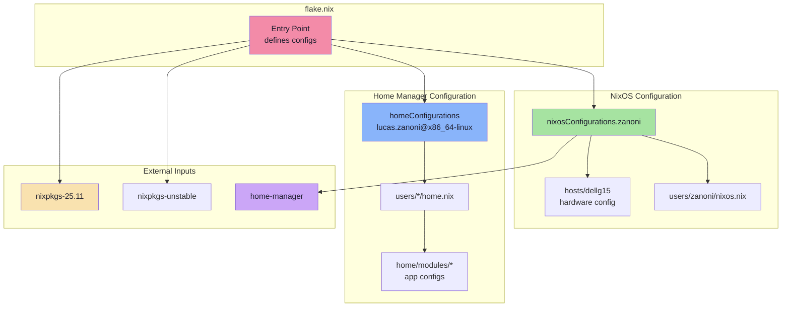

<h2 align="center"><a href="https://github.com/castrozan" target="_blank" rel="noopener noreferrer">Zanoni's</a> Desktop Configs</h2>

<p align="center">
  
</p>

<p align="center">
   <a href="https://github.com/Castrozan/.dotfiles/actions/workflows/ci.yml">
      
   </a>
   <a href="https://castrozan.github.io/.dotfiles/">
      
   </a>
   
   <a href="https://nixos.org/">
      
   </a>
</p>

Welcome to my dotfiles! This repository contains my desktop environment setup for both **NixOS** and **Ubuntu**. It's built with Nix Flakes and Home Manager.


<!-- ## 🎬 Showcase: Hyprland + Bash/Fish + Kitty + Neovim  -->
<!-- TODO: add desktop video showcase -->
<!-- *(More screenshots & videos coming soon!)* -->

<!-- ### Hyprland -->
<!-- TODO: add screenshots -->
<!-- *Coming soon! Currently ricing with waybar and fuzzel* -->

## Desktop Showcase

### Kitty ᓚᘏᗢ + Tmux

<details>
<summary>🪟 Panes</summary>


</details>
<details>
<summary>🪴 Screensaver</summary>


</details>
<details>
<summary>🔱 Sessions</summary>


</details>

### Neovim

<details>
<summary>:wq Editor</summary>


</details>
<details>
<summary>🎯 Focused Editor</summary>


</details>

---

## Getting Started

### The Declarative Way

Got NixOS from the <a href="https://nixos.org/download.html" target="_blank" rel="noopener noreferrer">installer</a>? Perfect. Here's how to deploy this flake:

<details>
<summary>
   <b>Quick Start for: ❄️ NixOS Users</b>
</summary>

#### 1. Clone the Repository
```bash
cd ~
git clone https://github.com/castrozan/.dotfiles.git
cd .dotfiles
```

#### 2. Generate Hardware Configuration
Replace `your_host` with your machine's identifier (e.g., `dellg15`):
```bash
sudo nixos-generate-config --dir hosts/your_host/configs
```

#### 3. Customize Your Configuration
- Copy and modify a user directory from `users/` (use `zanoni` as template)
- Update `flake.nix` to add your configuration in `nixosConfigurations`

#### 4. Deploy the Flake
```bash
sudo nixos-rebuild switch --flake .#your_user
```

#### 5. Post-Deployment
- Restart your system (recommended)
- Enjoy your new setup! 🎉

</details>

---

### Home Manager Standalone

Don't wanna go full NixOS for now? No worries! You can still use the flake with Home Manager to manage your dotfiles:
<details>
<summary>
   <b>Quick Start for: 🐧 Ubuntu/Non-NixOS systems</b>
</summary>

#### 1. Clone the Repository
```bash
cd ~
git clone https://github.com/castrozan/.dotfiles.git
cd .dotfiles
```

#### 2. Install Nix (if not already installed)
```bash
curl -L https://nixos.org/nix/install | sh -s -- --daemon
```

#### 3. Deploy with Home Manager
```bash
# For the lucas.zanoni configuration (adjust username as needed)
nix run home-manager/release-25.11 -- --flake .#lucas.zanoni@x86_64-linux switch -b "backup-$(date +%Y-%m-%d-%H-%M-%S)"
```
</details>

---

## 🏗️ Architecture Overview

<details>
<summary>📦 mermaid</summary>

Here's how everything fits together:



</details>

---

## 📂 Repository Structure - Relevant things

<details>
<summary>📂 Structure</summary>

```
.dotfiles/
├── .bashrc              # Main shell configuration (i'm using fish with bass)
├── .config/             # Application configs (hypr, kitty, tmux, nvim, etc.)
├── .shell_env_vars      # Local environment variables (git-ignored)
├── bin/                 # Custom shell scripts & utilities
├── home/                # Home Manager shared modules
├── hosts/               # NixOS hosts configuration
├── nixos/               # NixOS shared system modules
├── shell/               # Shell configurations (bash, fish, zsh)
├── users/               # User-specific configurations
│   ├── lucas.zanoni/    # Home Manager standalone config (Ubuntu/non-NixOS)
│   └── zanoni/          # Full NixOS system config
├── flake.nix            # Nix Flakes entry point
├── Makefile             # Helper commands
└── README.md            # This file!
```
</details>

---

## How to Explore Nix Options

Explore options for configurations directly from the repl so it is up to date with the rebuild command.

```bash
nix repl
```

Then in the REPL:
```nix
:lf .#homeConfigurations.lucas.zanoni@x86_64-linux
builtins.attrNames config.options.xdg.desktopEntries.type.getSubOptions
```

Or to see option descriptions:
```nix
config.options.xdg.desktopEntries.description
```
---

## 🔗 Inspiration & Credits

This setup is inspired by and borrows from:
- <a href="https://github.com/ryan4yin/nix-config" target="_blank" rel="noopener noreferrer">ryan4yin/nix-config</a> - Excellent complex Nix configurations
- <a href="https://github.com/OfflineBot/nixos" target="_blank" rel="noopener noreferrer">OfflineBot/nixos</a> - Clean NixOS setup
- The amazing NixOS and Home Manager communities
- And countless other dotfiles repos I've stumbled upon at 3 AM 🌙

## 📚 Resources

- <a href="https://nixos.org/manual" target="_blank" rel="noopener noreferrer">NixOS Manual</a> - Official documentation
- <a href="https://nix-community.github.io/home-manager/" target="_blank" rel="noopener noreferrer">Home Manager Manual</a> - Home Manager docs
- <a href="https://nixos.org/guides/nix-pills/" target="_blank" rel="noopener noreferrer">Nix Pills</a> - Learn Nix the fun way
- <a href="https://github.com/ryan4yin/nixos-and-flakes-book" target="_blank" rel="noopener noreferrer">NixOS & Flakes Book</a> - Comprehensive guide

---

Enjoy ricing and happy hacking! If you like this setup, consider giving it a ⭐