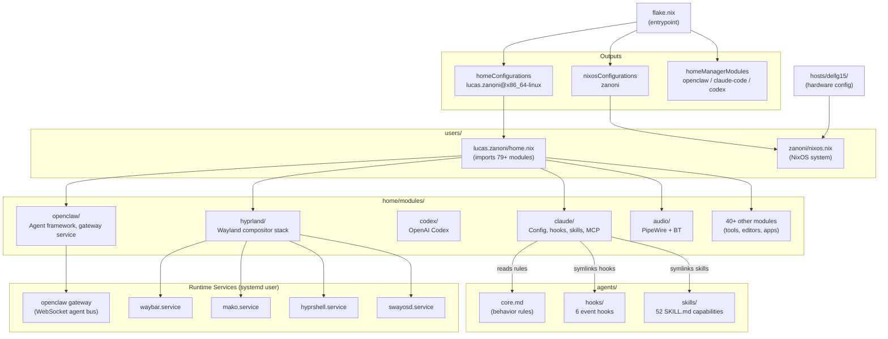

# ARCHITECTURE.md

> Auto-generated for AI agent consumption. Do not edit manually.

## 1. Overview

A declarative NixOS/home-manager dotfiles repository managing a complete Linux desktop environment for a single developer. It configures 50+ software modules, an AI agent orchestration framework (openclaw), and 52 specialized Claude Code skills. The repository supports two deployment modes: standalone home-manager on non-NixOS (Ubuntu) and full NixOS system configuration.

---

## 2. Tech Stack

| Layer | Technology | Version |
|---|---|---|
| Package manager | Nix flakes | — |
| System configuration | NixOS | nixpkgs 25.11 |
| User configuration | home-manager | release-25.11 |
| Shell | Fish + Bash | — |
| Wayland compositor | Hyprland | pinned commit `f68ac7ef` |
| Terminal | Kitty / WezTerm / Ghostty | — |
| Editor / AI agent | Claude Code | 2.1.42 |
| AI coding agent | Codex (OpenAI) | 0.98.0 |
| AI gateway | OpenClaw | via `openclaw-mesh` flake |
| Secret management | agenix | via `ryantm/agenix` |
| Test framework | BATS | — |
| Languages in repo | Nix, Bash, Fish, Python, JavaScript | — |

---

## 3. Project Structure

```
.dotfiles/
├── flake.nix                   # Entrypoint: declares all inputs/outputs
├── flake.lock                  # Pinned dependency versions
├── bin/                        # ~41 executable utility scripts (rebuild, git utils, hypr tools)
│   └── hypr/                   # Hyprland-specific helper scripts
├── home/                       # home-manager module library
│   ├── core.nix                # Base home config (username, homeDirectory, stateVersion)
│   ├── modules/                # 50+ opt-in feature modules
│   │   ├── claude/             # Claude Code integration (config, hooks, skills, MCP)
│   │   ├── codex/              # OpenAI Codex integration
│   │   ├── openclaw/           # Agent orchestration framework
│   │   ├── hyprland/           # Wayland compositor stack
│   │   ├── audio/              # PipeWire/Bluetooth audio
│   │   ├── gnome/              # GNOME fallback desktop
│   │   ├── vscode/             # VS Code / Cursor editor
│   │   └── [40+ single-file modules]
│   └── scripts/                # Nix-defined shell scripts (23 scripts)
├── hosts/                      # NixOS host-level hardware configs
│   └── dellg15/                # Dell G15 laptop (audio, NVIDIA, libinput)
├── users/                      # Per-user configuration entry points
│   ├── lucas.zanoni/           # Standalone home-manager user (non-NixOS)
│   │   ├── home.nix            # Imports all modules; main HM entrypoint
│   │   └── home/               # User-specific overrides (git, ssh, openclaw, hey-bot)
│   └── zanoni/                 # NixOS system user
│       ├── nixos.nix           # NixOS imports: hosts/dellg15, home-manager
│       └── home/               # Same user-specific overrides for NixOS
├── nixos/                      # NixOS-only system modules
│   └── modules/                # steam, fonts, tailscale, virtualization, xdg-portal, agenix
├── agents/                     # AI agent framework
│   ├── core.md                 # Agent behavior rules (consumed by Claude/Codex/Cursor)
│   ├── hooks/                  # Claude Code event hooks (Python + Shell)
│   ├── skills/                 # 52 SKILL.md-defined capabilities
│   └── openclaw/workspace/     # OpenClaw workspace seed files
├── shell/                      # Shell configuration sources
│   ├── fish/                   # Fish config.fish + conf.d/ scripts
│   ├── aliases.sh              # Cross-shell aliases
│   └── bash_env.sh             # Bash environment variables
├── secrets/                    # Age-encrypted secrets (agenix)
├── tests/                      # BATS test suites + CI scripts
│   ├── bin-scripts/            # Tests for bin/ utilities
│   ├── nix-modules/            # Home-manager module evaluation tests
│   ├── openclaw/               # OpenClaw live and nix-config tests
│   └── agent-evals/            # Claude agent behavior evaluation configs
├── docs/                       # Documentation
│   └── ai-context/             # AI-consumable architecture docs (this file)
├── .config/                    # App config files symlinked by home-manager
│   ├── hypr/                   # Hyprland config + themes (10 themes)
│   ├── nvim/                   # Neovim config (Lua)
│   ├── tmux/                   # Tmux config
│   └── waybar/                 # Status bar config
├── static/                     # Static assets (wallpapers, avatars)
├── docker-compose.yml          # Test container (profile: eval/modules)
└── .github/workflows/          # CI: tests.yml, nix-lint.yml, coverage.yml
```

---

## 4. Component Map



---

## 5. Data Flow

### System Rebuild Flow
```
bin/rebuild
  → detect OS (NixOS vs non-NixOS via /etc/os-release)
  → git submodule update --init
  → NixOS: sudo nixos-rebuild switch --flake ~/.dotfiles#zanoni
  → non-NixOS: home-manager switch --flake ~/.dotfiles#lucas.zanoni@x86_64-linux
  → flake.nix evaluates all modules
  → home-manager writes symlinks + files to $HOME
  → systemd user services reload
  → hypr-restart-hyprctl (if Hyprland running)
```

### Claude Code Hook Flow
```
Claude Code event (SessionStart | PreToolUse | PostToolUse)
  → hook-config.nix routes to run-hook.sh
  → run-hook.sh dispatches to Python hook script
  Hooks:
    SessionStart  → session-context.py      (inject project context)
    PreToolUse    → dangerous-command-guard.py (block risky commands)
                  → branch-protection.py    (protect main/master)
                  → tmux-reminder.py        (warn if not in tmux)
    PostToolUse   → auto-format.py          (run ruff/nixfmt/shfmt after edits)
                  → lint-on-edit.py         (run linters)
                  → nix-rebuild-trigger.py  (trigger rebuild on .nix edits)
```

### Secret Decryption Flow
```
secrets/*.age (age-encrypted files)
  → agenix decrypts at activation time using SSH key
  → written to ~/.secrets/<name>
  → shell/fish/conf.d/betha-secrets.fish sources them as env vars
  → home/modules/agenix.nix generates export script
```

### Theme System Flow
```
.config/hypr/themes/<theme-name>/
  colors.toml, btop.theme, neovim.lua, vscode.json
  → hypr-theme-set <theme-name>
  → renders .config/hypr/templates/*.tpl via yq/envsubst
  → writes to ~/.config/hypr-theme/current/theme/
  → services reload their configs from theme path
```

---

## 6. Configuration

### Key Configuration Files

| File | Purpose |
|---|---|
| `flake.nix` | Single source of truth for all inputs and outputs |
| `flake.lock` | Pinned versions of all flake inputs |
| `users/lucas.zanoni/home.nix` | Full module import list for non-NixOS user |
| `users/zanoni/nixos.nix` | Full NixOS system configuration entry |
| `home/modules/claude/config.nix` | Claude Code global settings JSON |
| `home/modules/claude/hook-config.nix` | Hook routing rules (event → script) |
| `home/modules/openclaw/config-options.nix` | OpenClaw agent definitions and options |
| `hosts/dellg15/configs/configuration.nix` | NixOS system-level options |
| `secrets/secrets.nix` | agenix secret key → public key mapping |
| `.config/hypr/hyprland.conf` | Hyprland compositor config (sources conf.d/) |
| `.config/tmux/tmux.conf` | Tmux base config (sources plugins.conf, settings.conf) |

### Special Args (Injected into all modules)

| Arg | Value | Description |
|---|---|---|
| `pkgs` | nixpkgs 25.11 | Stable packages |
| `unstable` | nixpkgs-unstable | Unstable packages |
| `latest` | nixpkgs-unstable (daily) | Bleeding-edge packages |
| `inputs` | all flake inputs | Access to external flakes |
| `username` | `lucas.zanoni` or `zanoni` | Current user |
| `isNixOS` | `true` or `false` | Platform discriminator |
| `home-version` | `"25.11"` | Home manager state version |
| `nixpkgs-version` | `"25.11"` | Nixpkgs channel version |

### Exported homeManagerModules

```nix
# flake.nix:133-144
homeManagerModules = {
  openclaw   = ./home/modules/openclaw;
  claude-code = ./home/modules/claude;
  codex      = ./home/modules/codex;
  default    = { imports = [ openclaw claude-code codex ]; };
};
```

---

## 7. Build & Deploy

### Apply Configuration

```bash
# Non-NixOS (Ubuntu) — standalone home-manager
bin/rebuild

# NixOS — full system rebuild
bin/rebuild  # auto-detects NixOS via /etc/os-release

# Direct commands (same as what rebuild runs)
home-manager switch --flake ~/.dotfiles#lucas.zanoni@x86_64-linux
sudo nixos-rebuild switch --flake ~/.dotfiles#zanoni
```

### CI Workflows (`.github/workflows/`)

| Workflow | Trigger | What it does |
|---|---|---|
| `tests.yml` | push/PR to main | `./tests/run-all.sh --ci` (BATS unit tests) |
| `nix-lint.yml` | push/PR to main | statix + deadnix + nixfmt + flake metadata eval |
| `coverage.yml` | push to main / PR | kcov-instrumented BATS, deploys to GitHub Pages |

### Tests

```bash
tests/run-all.sh           # All tests
tests/bin-scripts/*.bats   # Unit tests for bin/ scripts
tests/nix-modules/*.bats   # Nix module evaluation tests
tests/openclaw/*.bats      # OpenClaw integration tests
tests/agent-evals/         # Claude agent behavior evals (YAML configs)
```

### Docker (for CI module evaluation)

```bash
docker compose --profile eval up  # Runs tests/Dockerfile
```

---

## 8. Key Patterns

### Module Pattern (home/modules/)
Every feature is an opt-in Nix module. Modules use dependency injection via function arguments: `{ pkgs, inputs, config, lib, unstable, latest, isNixOS, ... }`. Platform-specific behavior uses `lib.mkIf isNixOS { ... }`.

### Skill Pattern (agents/skills/)
Each skill is a directory with a `SKILL.md` containing YAML frontmatter (`name`, `description`) followed by markdown instructions. Skills are symlinked into `~/.claude/skills/` and `~/.codex/skills/` by home-manager. Agents discover skills from filesystem at runtime.

### Hook Pattern (agents/hooks/)
Python scripts receiving JSON on stdin (Claude Code hook protocol). `run-hook.sh` wraps execution and handles exit codes. Non-zero exit from a `PreToolUse` hook blocks the tool call.

### Theme Pattern (.config/hypr/themes/)
Each theme directory contains `colors.toml` (color palette), `neovim.lua`, `btop.theme`, `vscode.json`. Template files in `.config/hypr/templates/*.tpl` are rendered by `hypr-theme-set` using `yq`/`envsubst` to produce per-app configs in `~/.config/hypr-theme/current/theme/`.

### Agent Orchestration (home/modules/openclaw/)
Agents are defined as Nix attrset options with `enable`, `model`, `workspace`, `skills`, `telegram`, `tts`. The openclaw gateway service exposes a WebSocket bus. Agents connect as clients; the gateway routes messages between Telegram bots and AI model backends.

### Private Config (home/modules/claude/private.nix)
Optional `private-config/claude/agents/` and `private-config/claude/skills/` directories (encrypted with git-crypt) are auto-discovered and symlinked alongside public skills/agents. The module gracefully skips if the directory does not exist.

### No Comments Convention
All code is self-documenting through long, descriptive names. Functions, variables, files, and directories use full descriptive identifiers. Comments appear only where logic cannot be expressed through naming.
