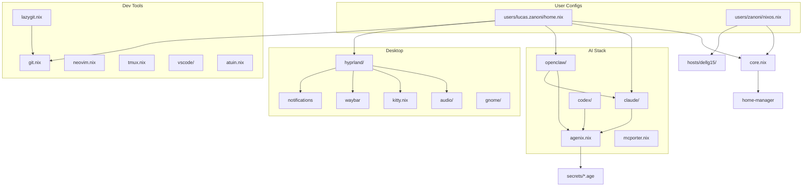

# MODULES.md

> Auto-generated for AI agent consumption. Do not edit manually.

## 1. Module Index

The `home/modules/` directory contains 50+ opt-in Nix modules imported via `users/<user>/home.nix`. Each module is self-contained.

### Core Infrastructure

| Module | File(s) | Purpose |
|--------|---------|---------|
| core | `home/core.nix` | Base home config: username, homeDirectory, stateVersion |
| agenix | `home/modules/agenix.nix` | Secret management via age encryption, env var export |
| claude | `home/modules/claude/` | Claude Code CLI config, hooks, skills, MCP servers |
| codex | `home/modules/codex/` | OpenAI Codex CLI integration |
| openclaw | `home/modules/openclaw/` | Multi-agent gateway, workspace deployment, service config |

### Desktop Environment

| Module | File(s) | Purpose |
|--------|---------|---------|
| hyprland | `home/modules/hyprland/` | Wayland compositor stack: config, themes, waybar, mako, fuzzel |
| gnome | `home/modules/gnome/` | GNOME fallback desktop environment |
| audio | `home/modules/audio/` | PipeWire config, Bluetooth audio policy, auto-switch service |
| kitty | `home/modules/kitty.nix` | Kitty terminal with theme integration |
| wezterm | `home/modules/wezterm.nix` | WezTerm terminal config |
| ghostty | `home/modules/ghostty.nix` | Ghostty terminal config |

### Developer Tools

| Module | File(s) | Purpose |
|--------|---------|---------|
| git | `home/modules/git.nix` | Git config, aliases, delta pager |
| neovim | `home/modules/neovim.nix` | Neovim with plugin management |
| vscode | `home/modules/vscode/` | VS Code / Cursor editor, extensions, settings |
| lazygit | `home/modules/lazygit.nix` | TUI git client |
| tmux | `home/modules/tmux.nix` | Terminal multiplexer config |
| atuin | `home/modules/atuin.nix` | Shell history search (fuzzy, no sync) |
| devenv | `home/modules/devenv.nix` | Nix-based dev environments |
| bruno | `home/modules/bruno.nix` | API client (Bruno) |
| k9s | `home/modules/k9s.nix` | Kubernetes TUI dashboard |

### AI & Agents

| Module | File(s) | Purpose |
|--------|---------|---------|
| claude | `home/modules/claude/config.nix` | Claude Code settings, CLAUDE.md generation, hooks |
| claude/hooks | `home/modules/claude/hook-config.nix` | Event hooks: auto-format, branch-protection, lint-on-edit |
| claude/plugins | `home/modules/claude/plugins.nix` | MCP servers: context7, sequential-thinking |
| codex | `home/modules/codex/` | OpenAI Codex config, instructions |
| openclaw | `home/modules/openclaw/` | Agent gateway service, workspace seed, Nix module |
| mcporter | `home/modules/mcporter.nix` | MCP-to-TypeScript bridge tool |

### Media & Fun

| Module | File(s) | Purpose |
|--------|---------|---------|
| ani-cli | `home/modules/ani-cli.nix` | Anime streaming CLI + mpv config |
| bad-apple | `home/modules/bad-apple.nix` | Terminal video player (Bad Apple, ASCII art) |
| bananas | `home/modules/bananas.nix` | Desktop pet AppImage |
| cbonsai | `home/modules/cbonsai.nix` | Terminal bonsai tree generator |
| cmatrix | `home/modules/cmatrix.nix` | Matrix rain screensaver |
| spotify | `home/modules/spotify.nix` | Spotify + spotify-player TUI |

### System Utilities

| Module | File(s) | Purpose |
|--------|---------|---------|
| brave | `home/modules/brave.nix` | Brave browser with GPU flags |
| obs | `home/modules/obs.nix` | OBS Studio for recording/streaming |
| satty | `home/modules/satty.nix` | Screenshot annotation tool |
| bluetui | `home/modules/bluetui.nix` | Bluetooth TUI manager |
| wiremix | `home/modules/wiremix.nix` | PipeWire audio mixer TUI |
| clipse | `home/modules/clipse.nix` | Clipboard manager |
| gogcli | `home/modules/gogcli.nix` | Google Workspace CLI (v0.11.0) |
| twitter | `home/modules/twitter.nix` | X/Twitter CLI tools (twikit, grok-search) |

### Networking & Services

| Module | File(s) | Purpose |
|--------|---------|---------|
| ssh | `users/*/home/ssh.nix` | SSH config, key management |
| tailscale | `nixos/modules/tailscale.nix` | Mesh VPN (NixOS only) |

---

## 2. Dependency Graph



---

## 3. Key Module Details

### agenix (`home/modules/agenix.nix`)

Secret management layer. Decrypts `.age` files from `secrets/` into `~/.secrets/` and exports them as environment variables.

- **Secrets with env vars**: `BETHA_EMAIL`, `BETHA_PASSWORD`, `JIRA_TOKEN`, `ELASTIC_PASSWORD`, `GRAFANA_PASSWORD`, `METABASE_API_KEY`, `WIKI_TOKEN`
- **Secrets without env vars**: `brave-api-key`, `gemini-api-key`, `openclaw-gateway-token`, `x-username`, `x-email`, `x-password`
- **Generated script**: `source-secrets.sh` — sources all secrets into current shell
- **Fish integration**: auto-sources secrets on shell startup

### claude (`home/modules/claude/`)

Multi-file module managing Claude Code CLI:

- `config.nix` — settings.json generation, CLAUDE.md deployment (from `agents/core.md`), env vars
- `hook-config.nix` — event hooks (PreToolUse, PostToolUse, Notification): auto-format, branch-protection, dangerous-command-guard, lint-on-edit, nix-rebuild-trigger, session-context, tmux-reminder
- `plugins.nix` — MCP server configuration (context7, sequential-thinking)
- `skills.nix` — skill symlinks from `agents/skills/` to `~/.claude/skills/`

### openclaw (`home/modules/openclaw/`)

Agent orchestration framework:

- `default.nix` — imports config + deploy + nix module
- `config.nix` — agent definitions, channel bindings, gateway settings
- `deploy.nix` — workspace seed files, agent workspace deployment
- `nix-module.nix` — home-manager module for openclaw package + systemd service

### hyprland (`home/modules/hyprland/`)

Wayland compositor with dynamic theming:

- `default.nix` — main compositor config, imports sub-modules
- `theme.nix` — theme engine: 14 themes (catppuccin, tokyo-night, gruvbox, nord, etc.), template-based config generation
- `waybar.nix` — status bar config with workspace indicators
- Themes live in `.config/hypr/themes/<name>/colors.toml` — each has wallpapers, color scheme, icons, editor theme

### audio (`home/modules/audio/`)

Cross-platform audio:

- `default.nix` — PipeWire config, Bluetooth auto-switch systemd service
- `bluetooth-policy.nix` — single source of truth for BT codecs, auto-connect, priorities
- Platform-aware: Ubuntu uses WirePlumber 0.4 Lua, NixOS uses 0.5 declarative conf
- **Rule**: Nix apps must use `ao=pulse` (not `ao=pipewire`) due to ABI mismatch on Ubuntu

---

## 4. Agents & Skills (`agents/`)

### Agent Framework Structure

```
agents/
├── core.md              — Shared behavior rules (consumed by CLAUDE.md)
├── hooks/               — 8 Claude Code hooks (Python + Shell)
├── skills/              — 52 SKILL.md-defined capabilities
└── openclaw/workspace/  — OpenClaw workspace seed files (AGENTS.md, etc.)
```

### Skills (52 total)

Organized by category:

**Infrastructure**: rebuild, dotfiles-expert, nix-expert, nixos-doctor, system-health, openclaw, openclaw-doctor, devenv
**Development**: commit, pull, worktrees, test, docs, repomix, codewiki, context7, claude-expert, claude-code-oneshot, create-claude-agents, ralph-expert, crewai
**Communication**: talk-to-user, notify, chats, hey-clever, speed-read
**Web & Data**: browser, web-researcher, twitter, youtube, polymarket, readitlater-processor
**Personal**: daily-note, ponto, obsidian-vault, phone-status, morning-brief, night-shift, usage-tracker
**AI Agents**: agent-architect, agent-grid, autonomous, avatar, model-switch, model-benchmark, claude-mem, prompt-engineering
**Desktop**: hyprland-debug, tmux, exit, pdf

---

## 5. Scripts (`bin/`)

41 executable utility scripts:

| Script | Purpose |
|--------|---------|
| `rebuild` | Canonical rebuild script — detects NixOS vs home-manager, runs appropriate switch |
| `hypr/theme` | Theme switcher — regenerates all configs from templates + colors.toml |
| `hypr/wallpaper-select` | Wallpaper picker per theme |
| `killport` | Kill process on a given port |
| `on` | "on <host> <command>" — SSH wrapper |
| `tar-unzip2dir` | Extract archive to named directory |
| `setup-oom-protection` | Configure systemd OOM scores |
| `nix-gc` | Nix garbage collection with configurable retention |

---

## 6. External Dependencies (Flake Inputs)

| Input | Purpose |
|-------|---------|
| `nixpkgs` (25.11) | Stable package set |
| `nixpkgs-unstable` | Bleeding-edge packages |
| `home-manager` (release-25.11) | User-level configuration |
| `agenix` | Secret management |
| `hyprland` (pinned) | Wayland compositor |
| `hyprshell` | Hyprland shell/overlay |
| `openclaw-mesh` | Agent orchestration framework |
| `nixgl` | OpenGL wrapper for non-NixOS |
| `devenv` | Development environments |
| `voice-pipeline` | Speech processing pipeline |
| `whisp-away` | Voice transcription |

---

## 7. NixOS-Only Modules (`nixos/modules/`)

| Module | Purpose |
|--------|---------|
| `steam.nix` | Steam gaming with Proton |
| `fonts.nix` | System font configuration |
| `tailscale.nix` | Mesh VPN service |
| `virtualization.nix` | Docker, VMs |
| `xdg-portal.nix` | Desktop portal integration |
| `agenix.nix` | System-level secret management |

---

## 8. Host Configurations (`hosts/`)

### dellg15

Dell G15 laptop hardware configuration:

- `configuration.nix` — system packages, services, locale
- `hardware-configuration.nix` — disk, boot, kernel modules
- `nvidia.nix` — NVIDIA GPU (hybrid mode, PRIME offload)
- `audio.nix` — hardware-specific audio fixes
- `libinput-quirks.nix` — touchpad quirk overrides
- `udev-rules/` — custom device rules
