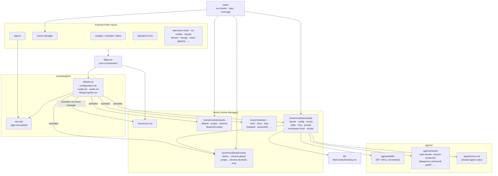
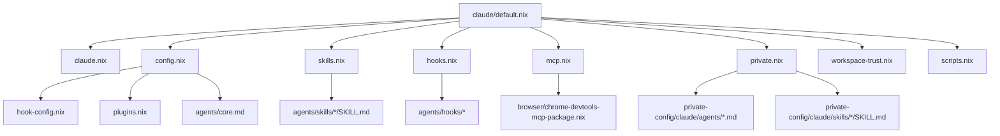
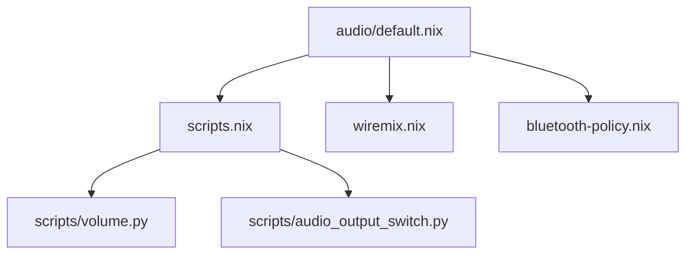

# MODULES.md

> Auto-generated for AI agent consumption. Do not edit manually.

## Module Index

All modules live under `home/modules/`. Each top-level directory is an independent domain module imported into the home configuration.

### AI Tooling

| Module | File(s) | Description |
|--------|---------|-------------|
| `claude` | `home/modules/claude/default.nix` | Root importer for all Claude Code sub-modules |
| `claude/claude.nix` | `home/modules/claude/claude.nix` | Fetches and installs the Claude Code binary as a pinned prebuilt |
| `claude/config.nix` | `home/modules/claude/config.nix` | Writes `settings.json` and `CLAUDE.md` files for global Claude configuration |
| `claude/hooks.nix` | `home/modules/claude/hooks.nix` | Symlinks all agent hook scripts from `agents/hooks/` into `~/.claude/hooks/` |
| `claude/hook-config.nix` | `home/modules/claude/hook-config.nix` | Pure data file declaring hook-to-trigger mappings (SessionStart, PreToolUse, PostToolUse) |
| `claude/mcp.nix` | `home/modules/claude/mcp.nix` | Configures MCP servers (`chrome-devtools`, `scrapling-fetch`) in `~/.claude/mcp.json` |
| `claude/plugins.nix` | `home/modules/claude/plugins.nix` | Provides language server packages (TypeScript, Java, Nix, Bash) for Claude Code |
| `claude/private.nix` | `home/modules/claude/private.nix` | Conditionally symlinks private agents and skills from `private-config/claude/` |
| `claude/scripts.nix` | `home/modules/claude/scripts.nix` | Installs the `claude-exit` shell script |
| `claude/skills.nix` | `home/modules/claude/skills.nix` | Symlinks all agent skill directories from `agents/skills/` into `~/.claude/skills/` |
| `claude/workspace-trust.nix` | `home/modules/claude/workspace-trust.nix` | Grants workspace trust for configured repository paths in Claude Code |

### Browser

| Module | File(s) | Description |
|--------|---------|-------------|
| `browser` | `home/modules/browser/default.nix` | Root importer for Chrome and Firefox sub-modules |
| `browser/chrome-global.nix` | `home/modules/browser/chrome-global.nix` | Registers a `chrome-global` desktop entry with a dedicated profile and sets it as the default MIME handler |
| `browser/chrome-devtools-mcp-package.nix` | `home/modules/browser/chrome-devtools-mcp-package.nix` | Builds the `chrome-devtools-mcp` npm package as a Nix derivation |
| `browser/firefox.nix` | `home/modules/browser/firefox.nix` | Configures Firefox with hardened policies, HTTPS-only mode, and curated extensions |
| `browser/scripts.nix` | `home/modules/browser/scripts.nix` | Provides the `pinchtab` browser automation tool and related helper scripts |

### Audio

| Module | File(s) | Description |
|--------|---------|-------------|
| `audio` | `home/modules/audio/default.nix` | Sets up PipeWire/Bluetooth audio services, ALSA unmute on start, and WireMix config |
| `audio/bluetooth-policy.nix` | `home/modules/audio/bluetooth-policy.nix` | Pure data file declaring Bluetooth audio codec and priority policy values |
| `audio/scripts.nix` | `home/modules/audio/scripts.nix` | Installs `volume` and `audio-output-switch` Python scripts |
| `audio/wiremix.nix` | `home/modules/audio/wiremix.nix` | Links the WireMix config file into XDG config |

## Dependency Graph


```mermaid
graph TD
    subgraph ext["External Flake Inputs"]
        nixpkgs["nixpkgs / unstable / latest"]
        hm_ext["home-manager"]
        agenix_ext["agenix"]
        hyprland_ext["hyprland v0.54"]
        other["openclaw-mesh · tui-notifier · bluetui\ndevenv · lazygit · voice-pipeline · ..."]
    end

    flake["flake.nix\n(root orchestrator)"]
    lib["lib/\nfetch-prebuilt-binary.nix"]

    subgraph host["hosts/dellg15/"]
        dellg15["default.nix\nconfiguration.nix\nnvidia.nix · audio.nix\nlibinput-quirks.nix"]
        secrets["secrets/\n(age-encrypted)"]
    end

    subgraph hm["home/ (Home Manager)"]
        home_core["home/core.nix"]
        audio["home/modules/audio\ndefault · scripts · wiremix\nbluetooth-policy"]
        browser["home/modules/browser\nfirefox · chrome-global\nscripts · chrome-devtools-mcp"]
        claude["home/modules/claude\nclaude · config · hooks\nskills · mcp · private\nworkspace-trust · scripts"]
        other_mods["home/modules/…\nnvim · tmux · kitty\nhyprland · quickshell · …"]
    end

    subgraph agents["agents/"]
        skills["agents/skills/\n(50+ SKILL.md entries)"]
        hooks["agents/hooks/\nauto-format · branch-protection\ndangerous-command-guard · …"]
        core_md["agents/core.md\n(shared agent rules)"]
    end

    tests["tests/\nnix-checks · bats · coverage"]

    ext --> flake
    agenix_ext --> secrets

    flake --> dellg15
    flake --> home_core

    dellg15 -->|"activates via home-manager"| home_core
    dellg15 -->|activates| audio
    dellg15 -->|activates| browser
    dellg15 -->|activates| claude
    dellg15 -->|activates| other_mods
    dellg15 --> secrets

    claude --> skills
    claude --> hooks
    claude --> core_md
    claude --> browser
    claude --> lib

    tests --> hm_ext
    tests --> audio
    tests --> browser
    tests --> claude
```

**Key dependency notes:**

| Dependent | Depends On | Mechanism |
|---|---|---|
| `home/modules/claude` | `agents/skills/` | Symlinked into `~/.claude/skills/` at build time |
| `home/modules/claude` | `agents/hooks/` | Symlinked into `~/.claude/hooks/` at build time |
| `home/modules/claude` | `agents/core.md` | Read via `builtins.readFile` for CLAUDE.md generation |
| `home/modules/claude/mcp.nix` | `home/modules/browser/chrome-devtools-mcp-package.nix` | Direct Nix `callPackage` |
| `home/modules/claude/claude.nix` | `lib/fetch-prebuilt-binary.nix` | Direct Nix `import` |
| `secrets/` | `agenix` (external) | Runtime decryption; keys declared in `secrets/secrets.nix` |
| `tests/nix-checks` | `self.homeManagerModules.claude-code` | Flake self-reference for eval checks |

## Key Module Details

### agenix

**Purpose:** Encrypts secrets at rest using age encryption. Secret files (`.age`) are committed to the repository and decrypted at activation time using SSH host keys. Provides a declarative secrets registry and the `agenix` CLI for re-encrypting secrets.

**Public interface:**
- `age.secrets.<name>` NixOS option — each entry produces a decrypted file at `/run/agenix/<name>` owned by a configurable user/group
- `secrets/secrets.nix` — registry mapping each `.age` file to the public keys authorized to decrypt it
- `agenix` CLI (`inputs.agenix.packages.${system}.default`) available in the dev shell for editing secrets

**Internal dependencies:**
- `inputs.agenix` (flake input: `github:ryantm/agenix`)
- `inputs.self.nixosModules.agenix` injected via `specialArgs` in `flake.nix`
- Host SSH host key at `/etc/ssh/ssh_host_ed25519_key` used as the decryption identity

**Key files:**
- `secrets/secrets.nix` — maps every `.age` file to authorized recipient public keys
- `secrets/api-keys/*.age`, `secrets/credentials/*.age`, `secrets/bot-tokens/*.age`, `secrets/infrastructure/*.age` — encrypted secret blobs
- `flake.nix` — imports `agenix.nixosModules.default` into the NixOS configuration

---

### claude

**Purpose:** Manages the complete Claude Code agent environment: binary installation, global settings, MCP servers, hooks (auto-format, lint, branch protection, session context), skills deployment, and language server packages for IDE features.

**Public interface:**
- Exposed as `self.homeManagerModules.claude-code` in `flake.nix`
- `claude` binary on `$PATH`
- `claude-exit` utility script to kill all claude processes
- `~/.claude/settings.json` — global config (model, permissions, hooks wiring)
- `~/.claude/CLAUDE.md` — global agent rules
- `~/.dotfiles/CLAUDE.md` — project-scoped rules (symlinked)
- `~/.claude/hooks/` — hook scripts
- `~/.claude/skills/` — skill directories (one per `agents/skills/*/`)
- `~/.claude/mcp.json` — MCP server config

**Internal dependencies:**


```mermaid
graph TD
    claude/default.nix --> claude.nix
    claude/default.nix --> config.nix
    claude/default.nix --> skills.nix
    claude/default.nix --> hooks.nix
    claude/default.nix --> mcp.nix
    claude/default.nix --> private.nix
    claude/default.nix --> workspace-trust.nix
    claude/default.nix --> scripts.nix
    config.nix --> hook-config.nix
    config.nix --> plugins.nix
    config.nix --> agents/core.md
    hooks.nix --> agents/hooks/*
    skills.nix --> agents/skills/*/SKILL.md
    mcp.nix --> browser/chrome-devtools-mcp-package.nix
    private.nix --> private-config/claude/agents/*.md
    private.nix --> private-config/claude/skills/*/SKILL.md
```

**Key files:**
- `home/modules/claude/default.nix` — module entry point
- `home/modules/claude/claude.nix` — fetches and wraps the prebuilt binary (version pinned via SHA256)
- `home/modules/claude/config.nix` — writes `settings.json`, `CLAUDE.md`, session env vars (API keys via `age.secrets`)
- `home/modules/claude/hook-config.nix` — hook wiring: SessionStart, PreToolUse (Bash), PostToolUse (Edit|Write), PostToolUse (Bash)
- `home/modules/claude/hooks.nix` — symlinks `agents/hooks/*.py|.sh` into `~/.claude/hooks/`
- `home/modules/claude/skills.nix` — symlinks all `agents/skills/*/` into `~/.claude/skills/`; synthesizes `core` skill from `agents/core.md`
- `home/modules/claude/mcp.nix` — configures `chrome-devtools` and `scrapling-fetch` MCP servers
- `home/modules/claude/private.nix` — optionally mounts `private-config/claude/` agents and skills (gitignored path)
- `home/modules/claude/plugins.nix` — returns LSP packages: `nixd`, `typescript-language-server`, `jdt-language-server`, `bash-language-server`
- `home/modules/claude/tests/checks.nix` — eval-time checks for settings.json, hooks dir, skills dir presence

---

### openclaw

**Purpose:** Deploys the openclaw-mesh agent network — a multi-agent orchestration system where claude agents communicate via a gateway. Installs the mesh daemon, injects the gateway token secret, and provides the `openclaw` CLI skill for reading agent chat.

**Public interface:**
- `openclaw-mesh` service/package from `inputs.openclaw-mesh`
- Gateway token exposed at runtime via `age.secrets.openclaw-gateway-token`
- `agents/skills/openclaw/SKILL.md` + `scripts/read-agent-chat.sh` — skill for reading agent conversation history

**Internal dependencies:**
- `inputs.openclaw-mesh` (flake input: `github:castrozan/openclaw-mesh`)
- `secrets/api-keys/openclaw-gateway-token.age`
- `age.secrets.openclaw-gateway-token` NixOS secret (decrypted at `/run/agenix/openclaw-gateway-token`)

**Key files:**
- `flake.nix` — declares `openclaw-mesh` flake input
- `hosts/dellg15/configs/configuration.nix` — imports openclaw-mesh module and wires the secret
- `secrets/api-keys/openclaw-gateway-token.age` — encrypted gateway token
- `agents/skills/openclaw/SKILL.md` — skill description and usage
- `agents/skills/openclaw/scripts/read-agent-chat.sh` — reads agent chat history

---

### hyprland

**Purpose:** Wayland compositor configuration. Manages window rules, keybindings, workspaces, input, appearance, autostart, and the hyprlock/hyprpaper screen-lock and wallpaper layers. Uses Stylix-driven template rendering for theme propagation.

**Public interface:**
- Hyprland installed from `inputs.hyprland` (pinned: `v0.54.0`)
- Config entry point: `.config/hypr/hyprland.conf`
- Modular conf.d fragments (one file per concern)
- Template system at `.config/hypr/templates/` — `.tpl` files rendered by Stylix into app configs
- `hyprlock` for screen lock, `hyprpaper` for wallpaper
- Submap `switcher-submap` for window switching modal

**Internal dependencies:**
- `inputs.hyprland` (flake input: `github:hyprwm/Hyprland/v0.54.0`)
- Stylix color/font pipeline renders `.tpl` → `.config/{app}/` files
- `quickshell` bar integration via autostart in `.config/hypr/conf.d/autostart.conf`
- `inputs.nixgl` for GL wrapping on non-NixOS-native launchers

**Key files:**
- `.config/hypr/hyprland.conf` — root config, `source`s all conf.d fragments
- `.config/hypr/conf.d/bindings.conf` — all keybindings
- `.config/hypr/conf.d/windows.conf` — window rules and layer rules
- `.config/hypr/conf.d/workspaces.conf` — workspace layout and rules
- `.config/hypr/conf.d/autostart.conf` — services launched on compositor start
- `.config/hypr/conf.d/appearance.conf` — decoration, animations, blur
- `.config/hypr/conf.d/input.conf` — keyboard/mouse/touchpad config
- `.config/hypr/conf.d/switcher-submap.conf` — window switcher modal keybindings
- `.config/hypr/hyprlock.conf` — lockscreen layout
- `.config/hypr/hyprpaper.conf` — wallpaper assignments
- `.config/hypr/templates/` — Stylix template sources for app theming
- `hosts/dellg15/configs/configuration.nix` — NixOS-level Hyprland enablement

---

### audio

**Purpose:** Manages the full audio stack: PipeWire/WirePlumber configuration, Bluetooth A2DP auto-switching, ALSA headphone unmute workaround (UCM init.conf bug), volume control scripts, and the `wiremix` TUI mixer.

**Public interface:**
- `volume` script — PulseAudio-backed volume control with OSD notifications
- `audio-output-switch` script — switches default PulseAudio sink with notification
- `systemctl --user start|stop bluetooth-audio-autoswitch` — Bluetooth sink-follow service
- `wiremix` — TUI audio mixer (config at `.config/wiremix/wiremix.toml`)

**Internal dependencies:**


```mermaid
graph TD
    audio/default.nix --> scripts.nix
    audio/default.nix --> wiremix.nix
    scripts.nix --> scripts/volume.py
    scripts.nix --> scripts/audio_output_switch.py
    audio/default.nix --> bluetooth-policy.nix
```

- `bluetooth-policy.nix` — pure data file (Nix attrset) defining codec priorities, sink/input priorities, and autoswitch behavior
- `pkgs.pulseaudio` (pactl), `pkgs.libnotify` (notify-send), `pkgs.gawk`, `pkgs.alsa-utils` runtime deps
- Host-level: `hosts/dellg15/configs/audio.nix` — NixOS-level PipeWire/ALSA enablement; `audio-policy.md` — policy doc

**Key files:**
- `home/modules/audio/default.nix` — systemd user services: `unmute-alsa-headphone-on-pipewire-start`, `bluetooth-audio-autoswitch`
- `home/modules/audio/bluetooth-policy.nix` — Bluetooth audio policy constants (codecs, priorities, autoswitch rules)
- `home/modules/audio/scripts.nix` — wraps Python scripts as Nix shell script bins
- `home/modules/audio/scripts/volume.py` — volume control logic
- `home/modules/audio/scripts/audio_output_switch.py` — output switching logic
- `home/modules/audio/wiremix.nix` — symlinks wiremix config
- `home/modules/audio/tests/checks.nix` — eval check for `bluetooth-audio-autoswitch` service existence
- `hosts/dellg15/configs/audio.nix` — system-level PipeWire, ALSA, Bluetooth enablement
- `hosts/dellg15/configs/audio-policy.md` — audio stack policy document
- `.config/wiremix/wiremix.toml` — wiremix TUI configuration

## Skills Catalog

All agent skills live in `agents/skills/`. Each skill has a `SKILL.md` with frontmatter (`name`, `description`, usage instructions) and optional `scripts/` subdirectory. Skills are symlinked to `~/.claude/skills/` at build time via `home/modules/claude/skills.nix`.

| Skill | Path | Purpose |
|-------|------|---------|
| `assistant-cron` | `agents/skills/assistant-cron/` | Schedule recurring tasks for the AI assistant at cron-style intervals |
| `avatar` | `agents/skills/avatar/` | Control virtual VTuber avatar with speech synthesis, lip-sync, and video capture |
| `browser` | `agents/skills/browser/` | Automate Chrome/Chromium via Pinchtab CDP bridge for web interactions |
| `claude` | `agents/skills/claude/` | Spawn and manage Claude Code sessions in tmux windows |
| `clipboard` | `agents/skills/clipboard/` | Read and write system clipboard using wl-clipboard |
| `codewiki` | `agents/skills/codewiki/` | Generate and update `docs/ai-context/` documentation for AI agents |
| `commit` | `agents/skills/commit/` | Create semantic git commits following conventional commit format |
| `context7` | `agents/skills/context7/` | Fetch current library/framework documentation via Context7 MCP server |
| `devenv` | `agents/skills/devenv/` | Enter and manage devenv development shell environments |
| `docs` | `agents/skills/docs/` | Write and maintain project documentation following project standards |
| `dotfiles` | `agents/skills/dotfiles/` | Modify dotfiles and trigger NixOS system rebuild |
| `exit` | `agents/skills/exit/` | Cleanly exit the current Claude agent session |
| `google-chat-browser` | `agents/skills/google-chat-browser/` | Send and read Google Chat messages via browser automation |
| `grid` | `agents/skills/grid/` | Submit tasks to and interact with the OpenClaw Grid agent network |
| `hey-clever` | `agents/skills/hey-clever/` | Send voice messages to the Clever AI assistant |
| `home-assistant` | `agents/skills/home-assistant/` | Control Home Assistant smart home devices via REST API |
| `hyprland-debug` | `agents/skills/hyprland-debug/` | Debug Hyprland compositor issues and inspect window/workspace state |
| `instructions` | `agents/skills/instructions/` | Display and apply core agent behavior instructions |
| `keyboard` | `agents/skills/keyboard/` | Simulate keyboard input using ydotool |
| `media-control` | `agents/skills/media-control/` | Control MPRIS media players (play, pause, skip, seek, volume) |
| `mouse` | `agents/skills/mouse/` | Simulate mouse movement and clicks using ydotool |
| `nix-expert` | `agents/skills/nix-expert/` | Expert guidance on Nix language and NixOS configuration |
| `notify` | `agents/skills/notify/` | Send desktop notifications to the user via notify-send |
| `obsidian` | `agents/skills/obsidian/` | Read and write Obsidian vault notes via headless REST API |
| `openclaw` | `agents/skills/openclaw/` | Communicate with the OpenClaw agent mesh network |
| `phone-status` | `agents/skills/phone-status/` | Check phone battery and connectivity status via ADB |
| `ponto` | `agents/skills/ponto/` | Fill HR timesheet entries in Ponto Mais via browser automation |
| `pull` | `agents/skills/pull/` | Pull latest changes from git remote and update branches |
| `quickshell` | `agents/skills/quickshell/` | Modify Quickshell bar components and restart the systemd service |
| `rebuild` | `agents/skills/rebuild/` | Rebuild and switch NixOS system configuration |
| `research` | `agents/skills/research/` | Perform web research using Brave Search and Tavily APIs |
| `screenshot` | `agents/skills/screenshot/` | Capture desktop screenshots using grimblast/grim |
| `spawn-claude` | `agents/skills/spawn-claude/` | Spawn a new Claude Code session in a background tmux window |
| `speed-read` | `agents/skills/speed-read/` | Display text in RSVP speed-reading format via readItNow-rc |
| `system-health` | `agents/skills/system-health/` | Check system health metrics (CPU, memory, disk, services) |
| `talk-to-user` | `agents/skills/talk-to-user/` | Send spoken TTS audio messages to the user |
| `test` | `agents/skills/test/` | Run test suites for the dotfiles project |
| `tldr` | `agents/skills/tldr/` | Summarize content concisely |
| `tmux` | `agents/skills/tmux/` | Manage tmux sessions, windows, panes, and send commands |
| `twitter` | `agents/skills/twitter/` | Read and post to Twitter/X via twikit CLI |
| `worktrees` | `agents/skills/worktrees/` | Manage git worktrees for parallel development branches |
| `youtube` | `agents/skills/youtube/` | Search and play YouTube videos via youtube-cli |

The synthetic `core` skill is generated at build time from `agents/core.md` and installed to `~/.claude/skills/core/SKILL.md`.

---

## Scripts Reference

There is no top-level `bin/` directory. Executable scripts are installed via Nix `writeShellScriptBin` into the user profile, agent hook scripts run inside Claude sessions, and eval scripts support CI validation.

### User-facing executables (installed to profile via Nix)

| Script | Defined in | Purpose |
|--------|-----------|---------|
| `volume` | `home/modules/audio/scripts.nix` | Adjust PulseAudio volume with OSD notification; wraps `home/modules/audio/scripts/volume.py` |
| `audio-output-switch` | `home/modules/audio/scripts.nix` | Switch default audio output sink with libnotify notification |
| `pinchtab` | `home/modules/browser/scripts.nix` | Launch Pinchtab Chrome automation bridge (CDP) |
| `pinchtab-act-and-snapshot` | `home/modules/browser/scripts.nix` | Execute a CDP action then capture a DOM snapshot |
| `pinchtab-ensure-running` | `home/modules/browser/scripts.nix` | Ensure the pinchtab bridge process is running before automation |
| `claude-exit` | `home/modules/claude/scripts.nix` | Kill all Claude Code processes in the current user session |
| `game-shift` | `hosts/dellg15/scripts/game-shift.nix` | Toggle Dell G15 performance shift mode (fan curve and GPU boost) |

### Agent hook scripts (`agents/hooks/`)

Installed to `~/.claude/hooks/` and wired into Claude's hook configuration via `home/modules/claude/hook-config.nix`.

| Script | Event | Purpose |
|--------|-------|---------|
| `run-hook.sh` | — | Dispatcher wrapper; runs a hook script and normalizes exit codes |
| `session-context.py` | `SessionStart` | Inject session context (current date, branch, working directory) |
| `dangerous-command-guard.py` | `PreToolUse/Bash` | Block destructive shell commands (`rm -rf`, force-push, truncation) |
| `branch-protection.py` | `PreToolUse/Bash` | Prevent direct commits or modifications on protected branches |
| `tmux-reminder.py` | `PreToolUse/Bash` | Remind agent to use tmux for long-running or interactive commands |
| `auto-format.py` | `PostToolUse/Edit\|Write` | Auto-run formatters (nixfmt, ruff, shfmt) after file edits |
| `lint-on-edit.py` | `PostToolUse/Edit\|Write` | Run language-appropriate linters on edited files |
| `nix-rebuild-trigger.py` | `PostToolUse/Edit\|Write` | Suggest `rebuild` skill when `.nix` files are modified |

### Eval and validation scripts (`agents/evals/`)

| Script | Purpose |
|--------|---------|
| `agents/evals/run-evals.py` | Execute agent skill and hook evaluation test suite against configured rules |
| `agents/evals/validate-skill-frontmatter.sh` | Validate that all `SKILL.md` files contain required YAML frontmatter fields |
| `tests/validate-skill-frontmatter.sh` | Mirror validation script used in CI test runs |

## External Dependencies

### Flake Inputs

| Input | URL | Pin Strategy | Purpose |
|-------|-----|-------------|---------|
| `nixpkgs` | `github:nixos/nixpkgs/nixos-25.11` | stable channel | Primary package set |
| `nixpkgs-unstable` | `github:nixos/nixpkgs/nixos-unstable` | unstable channel | Packages not yet in stable |
| `nixpkgs-latest` | `github:nixos/nixpkgs/nixos-unstable` | unstable channel (daily-updated alias) | Bleeding-edge packages |
| `home-manager` | `github:nix-community/home-manager/release-25.11` | stable channel, follows `nixpkgs` | Home environment management |
| `tui-notifier` | `github:castrozan/tui-notifier/1.0.1` | tag `1.0.1` | TUI notification tool |
| `systemd-manager-tui` | `github:matheus-git/systemd-manager-tui` | default branch, follows `nixpkgs` | Systemd manager TUI |
| `readItNow-rc` | `github:castrozan/readItNow-rc/1.1.0` | tag `1.1.0` | Read-it-now tool |
| `opencode` | `github:anomalyco/opencode/v1.2.22` | tag `v1.2.22` | OpenCode AI editor |
| `devenv` | `github:cachix/devenv/v1.11.2` | tag `v1.11.2` | Developer environments |
| `bluetui` | `github:castrozan/bluetui/v0.9.1` | tag `v0.9.1` | Bluetooth TUI |
| `cbonsai` | `github:castrozan/cbonsai` | default branch | Terminal bonsai tree |
| `cmatrix` | `github:castrozan/cmatrix` | default branch | Matrix terminal animation |
| `tuisvn` | `github:castrozan/tuisvn` | default branch | SVN TUI client |
| `install-nothing` | `github:castrozan/install-nothing` | default branch | Install-nothing utility |
| `openclaw-mesh` | `github:castrozan/openclaw-mesh` | default branch | OpenClaw mesh tooling |
| `lazygit` | `github:Castrozan/lazygit` | default branch | Lazygit fork |
| `nixgl` | `github:nix-community/nixGL` | default branch | OpenGL wrapper for non-NixOS |
| `agenix` | `github:ryantm/agenix` | default branch | Age-encrypted secrets |
| `viu` | `github:Castrozan/viu` | default branch | Terminal image viewer fork |
| `voice-pipeline` | `github:castrozan/voice-pipeline` | default branch | Voice pipeline tooling |
| `voxtype` | `github:peteonrails/voxtype` | default branch | Voice typing tool |
| `whisp-away` | `github:madjinn/whisp-away` | default branch | Whisper-based transcription |
| `hyprland` | `github:hyprwm/Hyprland/v0.54.0` | tag `v0.54.0` | Wayland compositor |
| `google-workspace-cli` | `github:googleworkspace/cli` | default branch | Google Workspace CLI |

### NixOS-Only Modules

These modules exist under `hosts/dellg15/configs/` and are imported exclusively by the NixOS system configuration (`hosts/dellg15/configs/configuration.nix`). They are not available to Home Manager.

| File | Purpose |
|------|---------|
| `hosts/dellg15/configs/hardware-configuration.nix` | Auto-generated hardware scan (filesystems, kernel modules, initrd) |
| `hosts/dellg15/configs/audio.nix` | PipeWire/PulseAudio system-level audio configuration |
| `hosts/dellg15/configs/nvidia.nix` | NVIDIA driver, PRIME offload, power management |
| `hosts/dellg15/configs/libinput-quirks.nix` | udev quirks for Dell G15 touchpad |
| `hosts/dellg15/scripts/game-shift.nix` | Dell G15 game-shift key script, exposed as a system package |

Policy documents co-located with NixOS modules:

| File | Governs |
|------|---------|
| `hosts/dellg15/configs/audio-policy.md` | Audio stack boundaries and constraints |
| `hosts/dellg15/configs/nvidia-policy.md` | GPU offload and power management policy |

```
hosts/dellg15/
├── default.nix                  # Host entry point — imports all configs
├── configs/
│   ├── configuration.nix        # Top-level NixOS system config
│   ├── hardware-configuration.nix
│   ├── audio.nix
│   ├── audio-policy.md
│   ├── nvidia.nix
│   ├── nvidia-policy.md
│   ├── libinput-quirks.nix
│   └── udev-rules/
│       └── 99-dell-g15-touchpad.rules
└── scripts/
    ├── default.nix
    └── game-shift.nix
```

