# MODULES.md

> Auto-generated for AI agent consumption. Do not edit manually.

## Module Index

### Core / System

| Module | Description |
|--------|-------------|
| `home/modules/agenix.nix` | Decrypts age-encrypted secrets and exports them as environment variables via a shell script |
| `home/modules/core.nix` (via `home/core.nix`) | Sets home directory, state version, and enables home-manager self-management |

### AI / Agents

| Module | Description |
|--------|-------------|
| `home/modules/claude/default.nix` | Entry point aggregating all Claude Code submodules |
| `home/modules/claude/claude.nix` | Installs Claude Code binary with auto-updater disabled and symlinks private skill directories |
| `home/modules/claude/config.nix` | Generates `~/.claude/settings.json` with model, permissions, hooks, and MCP plugins config |
| `home/modules/claude/hooks.nix` | Symlinks all hook scripts from `agents/hooks/` into `~/.claude/hooks/` |
| `home/modules/claude/hook-config.nix` | Declares hook trigger bindings (SessionStart, PreToolUse, PostToolUse) by tool matcher |
| `home/modules/claude/mcp.nix` | Configures MCP servers (chrome-devtools) in `~/.claude/mcp.json` |
| `home/modules/claude/plugins.nix` | Declares LSP packages (typescript, java, nix, bash) and maps them to Claude plugins |
| `home/modules/claude/skills.nix` | Symlinks all skill directories from `agents/skills/` into `~/.claude/skills/` |
| `home/modules/claude/private.nix` | Conditionally symlinks private agents/skills from `private-config/claude/` if present |

### Audio

| Module | Description |
|--------|-------------|
| `home/modules/audio/default.nix` | Configures PipeWire audio, Bluetooth autoswitch systemd service, and WirePlumber policy |
| `home/modules/audio/bluetooth-policy.nix` | Single source of truth for Bluetooth codec and priority policy values |

### Media / Entertainment

| Module | Description |
|--------|-------------|
| `home/modules/ani-cli.nix` | Installs ani-cli and mpv for terminal anime streaming |
| `home/modules/bad-apple.nix` | Installs `bad-apple` command that plays curated B&W music videos in the terminal via chafa |

### Bluetooth

| Module | Description |
|--------|-------------|
| `home/modules/bluetui.nix` | Installs bluetui TUI Bluetooth manager from external flake input |

### Clipboard

| Module | Description |
|--------|-------------|
| `home/modules/clipse.nix` | Installs custom Wayland clipboard manager fork (clipse-zanoni) with keybindings and theme config |

### Development Tools

| Module | Description |
|--------|-------------|
| `home/modules/atuin.nix` | Configures atuin shell history with fuzzy search, fish/bash integration, and filtered commands |
| `home/modules/bruno.nix` | Installs Bruno API client with desktop entry and default collections path |
| `home/modules/ccost.nix` | Installs ccost binary for Claude API usage tracking and cost analysis |

### Browser

| Module | Description |
|--------|-------------|
| `home/modules/chrome-global.nix` | Wraps Chrome with a dedicated profile (`chrome-global`) and sets it as default MIME handler |

### Misc Packages

| Module | Description |
|--------|-------------|
| `home/modules/bananas.nix` | Installs Bananas AppImage (screen annotation/recording tool) |
| `home/modules/cbonsai.nix` | Installs cbonsai terminal bonsai tree animation from external flake input |

## Dependency Graph

```mermaid
graph TD
    flake["flake.nix\n(entry point)"]

    nixpkgs["nixpkgs / nixpkgs-unstable\n(upstream)"]
    hm["home-manager input"]
    agenix_input["agenix input"]
    external["external flakes\n(bluetui, cbonsai, openclaw-mesh,\nhyprland, voice-pipeline, etc.)"]

    hosts["hosts/dellg15/\nNixOS host config"]
    home["home/\nhome-manager config"]
    secrets["secrets/*.age\n(agenix encrypted)"]

    home_core["home/core.nix"]
    home_modules["home/modules/*"]
    claude_module["home/modules/claude/\n(default, claude, config, skills,\nhooks, mcp, plugins, private)"]
    agenix_module["home/modules/agenix.nix"]
    audio_module["home/modules/audio/\n(default + bluetooth-policy)"]
    agents_dir["agents/\n(core.md, hooks/, skills/)"]
    private_config["private-config/claude/\n(git-crypted, optional)"]

    flake --> nixpkgs
    flake --> hm
    flake --> agenix_input
    flake --> external
    flake --> hosts
    flake --> home

    hosts --> nixpkgs
    hosts --> home

    home --> home_core
    home --> home_modules
    home_modules --> claude_module
    home_modules --> agenix_module
    home_modules --> audio_module

    claude_module --> agents_dir
    claude_module --> private_config

    agenix_module --> secrets
    agenix_module --> agenix_input

    audio_module --> audio_module

    subgraph claude_submodules["claude/ submodules"]
        claude_config["config.nix\n(settings.json, CLAUDE.md)"]
        claude_skills["skills.nix\n(symlinks agents/skills/)"]
        claude_hooks["hooks.nix\n(symlinks agents/hooks/)"]
        claude_mcp["mcp.nix\n(mcp.json)"]
        claude_plugins["plugins.nix\n(LSP packages + plugins)"]
        claude_private["private.nix\n(optional private agents/skills)"]
    end

    claude_module --> claude_config
    claude_module --> claude_skills
    claude_module --> claude_hooks
    claude_module --> claude_mcp
    claude_module --> claude_plugins
    claude_module --> claude_private

    claude_config --> agents_dir
    claude_skills --> agents_dir
    claude_hooks --> agents_dir
    claude_private --> private_config

    subgraph agents_content["agents/"]
        agents_core["core.md"]
        agents_hooks["hooks/*.py / run-hook.sh"]
        agents_skills["skills/*/SKILL.md"]
    end

    agents_dir --> agents_core
    agents_dir --> agents_hooks
    agents_dir --> agents_skills
```



## Key Module Details

---

### `agenix` — Secret Management

**Purpose:** Encrypts secrets at rest using age encryption, decrypts them to `~/.secrets/` at activation time, and exports selected secrets as environment variables via a generated shell script.

**Key files:**
- `home/modules/agenix.nix` — sole module file
- `secrets/*.age` — encrypted secret files
- `secrets/secrets.nix` — declares which public keys can decrypt which secrets

**Public interface:**
```
~/.secrets/<secret-name>          # decrypted file path
~/.secrets/source-secrets.sh     # sourceable script that exports env vars
```

**Environment variables exported automatically:**
| Secret | Variable |
|--------|----------|
| `betha-email` | `BETHA_EMAIL` |
| `betha-password` | `BETHA_PASSWORD` |
| `jira-token` | `JIRA_TOKEN` |
| `elastic-password` | `ELASTIC_PASSWORD` |
| `grafana-password` | `GRAFANA_PASSWORD` |
| `metabase-api-key` | `METABASE_API_KEY` |
| `wiki-token` | `WIKI_TOKEN` |

**Secrets without env vars** (file-only): `brave-api-key`, `gemini-api-key`, `openclaw-gateway-token`, `x-username`, `x-email`, `x-password`, plus Telegram bot tokens, SSH keys, and API keys.

**Internal deps:** `inputs.agenix` (from `flake.nix`), `config.home.homeDirectory`, `lib.concatStringsSep`, `lib.mapAttrsToList`

---

### `claude` — Claude Code Configuration

**Purpose:** Installs and configures Claude Code CLI — the binary, global settings, hooks, skills, MCP servers, LSP plugins, and private agents.

**Key files:**
```
home/modules/claude/
├── default.nix       # imports all submodules
├── claude.nix        # fetches and wraps the binary (v2.1.42)
├── config.nix        # settings.json, CLAUDE.md files
├── hook-config.nix   # hook event → command mapping
├── hooks.nix         # symlinks agents/hooks/ → ~/.claude/hooks/
├── skills.nix        # symlinks agents/skills/ → ~/.claude/skills/
├── mcp.nix           # MCP server config (chrome-devtools)
├── plugins.nix       # LSP packages + enabled Claude plugins
└── private.nix       # optional private-config/claude/ overlay
```

**Public interface:**
```
~/.claude/settings.json           # global Claude Code settings
~/.claude/CLAUDE.md               # global agent rules
~/.dotfiles/CLAUDE.md             # dotfiles-scoped rules
~/.claude/hooks/                  # hook scripts
~/.claude/skills/<name>/SKILL.md  # skill definitions
~/.claude/mcp.json                # MCP server config
~/.local/bin/claude               # binary symlink
```

**Settings highlights** (`config.nix`):
- `model: opus`, `language: english`
- `dangerouslySkipPermissions: true`, `defaultMode: bypassPermissions`
- `shouldChimeAfterChatFinishes: true`

**Hook events configured:**
```
SessionStart  → session-context.py
PreToolUse    → dangerous-command-guard.py, branch-protection.py, tmux-reminder.py  (Bash only)
PostToolUse   → auto-format.py, lint-on-edit.py  (Edit|Write only)
PostToolUse   → nix-rebuild-trigger.py  (Edit|Write on *.nix)
```

**LSP plugins managed:**
- `typescript-language-server`, `typescript` → `typescript-lsp@claude-plugins-official`
- `jdt-language-server` → `jdtls-lsp@claude-plugins-official`
- `nixd`, `nixfmt-rfc-style` (no Claude plugin)
- `bash-language-server` (no Claude plugin)

**Internal deps:** `agents/core.md`, `agents/hooks/`, `agents/skills/`, `pkgs.nodejs_22`, `pkgs.chromium`, optionally `private-config/claude/`

---

### `openclaw` — AI Agent Gateway Integration

**Purpose:** Manages secrets and configuration for the OpenClaw multi-agent platform — Telegram bot tokens, gateway tokens, and agent grid SSH keys. Does not configure the gateway itself (runs externally via `docker-compose.yml`).

**Key files:**
```
secrets/openclaw-gateway-token.age
secrets/telegram-bot-token*.age       # one per agent (clever, golden, jarvis, jenny, monster, robson, silver)
secrets/grid-token-clever.age
secrets/grid-token-robson.age
secrets/grid-hosts.age
agents/openclaw/workspace/AGENTS.md  # workspace-level agent instructions
agents/skills/openclaw/SKILL.md      # openclaw CLI skill
agents/skills/openclaw/scripts/read-agent-chat.sh
agents/skills/openclaw-doctor/SKILL.md
docker-compose.yml                   # gateway service definition
```

**Secret → path mapping** (via agenix):
```
openclaw-gateway-token  →  ~/.secrets/openclaw-gateway-token
telegram-bot-token-*    →  ~/.secrets/telegram-bot-token-*
grid-token-*            →  ~/.secrets/grid-token-*
grid-hosts              →  ~/.secrets/grid-hosts
```

**Skills provided to Claude:**
- `openclaw` — CLI operations: managing agents, channels, gateway config
- `openclaw-doctor` — diagnose/fix gateway issues, read logs, check service health

**Internal deps:** `agenix` module, `flake.nix` input `openclaw-mesh`

---

### `hyprland` — Wayland Compositor Configuration

**Purpose:** Full Hyprland WM configuration with a theme engine that propagates color tokens to every application via template rendering.

**Key files:**
```
.config/hypr/
├── hyprland.conf              # main entry, sources conf.d/
├── conf.d/
│   ├── appearance.conf        # gaps, borders, blur, animations
│   ├── autostart.conf         # startup programs
│   ├── bindings.conf          # keybindings
│   ├── env.conf               # environment variables
│   ├── input.conf             # keyboard/mouse/touchpad
│   ├── windows.conf           # window rules
│   └── workspaces.conf        # workspace rules
├── hyprlock.conf              # lockscreen
├── hyprpaper.conf             # wallpaper
├── templates/                 # *.tpl files — one per app
├── themes/                    # one dir per theme
│   └── <theme>/
│       ├── colors.toml        # color palette (source of truth)
│       ├── backgrounds/       # wallpaper images
│       ├── btop.theme
│       ├── neovim.lua
│       ├── vscode.json
│       ├── icons.theme
│       └── [light.mode]       # presence = light mode
└── user/autostart.conf        # user-local autostart overrides
```

**Theme engine data flow:**


**Available themes:** `catppuccin`, `catppuccin-latte`, `ethereal`, `everforest`, `flexoki-light`, `gruvbox`, `kanagawa`, `nord`, `osaka-jade`, `rose-pine`, `tokyo-night`

**Skill:** `agents/skills/hyprland-debug/SKILL.md` — diagnose theme switching failures, window disappearance, service crashes, display issues

**Internal deps:** `home/modules/clipse.nix` (clipboard), `home/modules/audio/` (PipeWire), waybar, fuzzel, mako/swaync, hyprshell

---

### `audio` — PipeWire Audio Stack

**Purpose:** Configures PipeWire as the audio server with WirePlumber for device policy, Bluetooth audio auto-switching, and cross-platform (NixOS + Ubuntu) compatibility.

**Key files:**
```
home/modules/audio/
├── default.nix            # main module — systemd service + WirePlumber config
└── bluetooth-policy.nix   # single source of truth for BT policy values
```

**Bluetooth policy** (`bluetooth-policy.nix`):
```nix
autoConnect    = ["a2dp_sink" "a2dp_source"]
codecs         = ["aac" "sbc_xq" "sbc"]
autoswitchToHeadsetProfile = false
sinkPriority   = 3000
inputPriority  = 2000
```

**Systemd service:** `bluetooth-audio-autoswitch.service`
- Subscribes to `pactl` events
- On new `bluez_output.*` sink → sets it as default via `pactl set-default-sink`
- `After=pipewire-pulse.service`, `WantedBy=pipewire-pulse.service`

**Platform split:**
```
isNixOS = true  → wireplumber.extraConfig (declarative Nix)
isNixOS = false → xdg.configFile (Ubuntu Lua WirePlumber 0.4)
```

**Critical constraint:** Nix apps must use `ao=pulse` (not `ao=pipewire`) — libpipewire version mismatch between Nix store and Ubuntu system causes ABI break. PulseAudio protocol is version-independent via `pipewire-pulse`.

**Internal deps:** `pkgs.pulseaudio` (for `pactl`), `pkgs.gnugrep`, `pkgs.gawk`, `isNixOS` flag injected from host config, `bluetooth-policy.nix`

## Skills Catalog

All skills live in `agents/skills/`. Each has a `SKILL.md` defining its name, description, and usage trigger.

| Skill | Path | Purpose |
|---|---|---|
| agent-architect | `agents/skills/agent-architect/` | Design AI agents, rules, skills, and prompts |
| agent-grid | `agents/skills/agent-grid/` | Inter-agent communication via bot bridge and talk-to-agent scripts |
| autonomous | `agents/skills/autonomous/` | Autonomous agent loop pattern (Ralph Loop) |
| avatar | `agents/skills/avatar/` | VTuber avatar control with lip sync, expressions, virtual camera/mic |
| browser | `agents/skills/browser/` | Playwright-based browser automation and web interaction |
| chats | `agents/skills/chats/` | Chat management across channels |
| claude-code-oneshot | `agents/skills/claude-code-oneshot/` | One-shot autonomous Claude Code sessions for delegated tasks |
| claude-expert | `agents/skills/claude-expert/` | Claude Code CLI configuration, hooks, MCP, and usage optimization |
| claude-mem | `agents/skills/claude-mem/` | Claude memory management across sessions |
| codewiki | `agents/skills/codewiki/` | Regenerate AI-consumable codebase docs in `docs/ai-context/` |
| commit | `agents/skills/commit/` | High-quality git commits with conventional format |
| context7 | `agents/skills/context7/` | Fetch up-to-date library documentation from Context7 |
| core | _(generated from `agents/core.md` via `home/modules/claude/skills.nix`)_ | Expose core agent behavior instructions |
| create-claude-agents | `agents/skills/create-claude-agents/` | Create custom Claude Code agents in YAML format |
| crewai | `agents/skills/crewai/` | Multi-agent orchestration with CrewAI |
| daily-note | `agents/skills/daily-note/` | Manage Obsidian daily notes and TODO tracking |
| devenv | `agents/skills/devenv/` | Nix-based development environments with devenv |
| docs | `agents/skills/docs/` | Documentation policies and standards |
| dotfiles-expert | `agents/skills/dotfiles-expert/` | Expert on this NixOS dotfiles repository |
| duckdb | `agents/skills/duckdb/` | Query and manage the shared DuckDB persistent data store |
| exit | `agents/skills/exit/` | Safely terminate the current Claude Code session |
| hey-clever | `agents/skills/hey-clever/` | Push-to-talk voice assistant (whisp-away → OpenClaw pipeline) |
| hyprland-debug | `agents/skills/hyprland-debug/` | Debug Hyprland/Wayland issues |
| model-benchmark | `agents/skills/model-benchmark/` | Benchmark AI model performance |
| model-switch | `agents/skills/model-switch/` | Switch agent model at runtime and restart |
| morning-brief | `agents/skills/morning-brief/` | Morning briefing and daily planning |
| night-shift | `agents/skills/night-shift/` | Night shift monitoring and handoff |
| nix-expert | `agents/skills/nix-expert/` | Nix language, expressions, modules, flakes, and ecosystem tools |
| nixos-doctor | `agents/skills/nixos-doctor/` | Diagnose and fix NixOS configuration issues |
| notify | `agents/skills/notify/` | Send notifications to the user |
| obsidian-vault | `agents/skills/obsidian-vault/` | Obsidian vault management and note operations |
| openclaw | `agents/skills/openclaw/` | OpenClaw multi-agent platform CLI operations |
| openclaw-doctor | `agents/skills/openclaw-doctor/` | Diagnose and fix OpenClaw gateway issues |
| pdf | `agents/skills/pdf/` | PDF processing, form filling, text extraction |
| phone-status | `agents/skills/phone-status/` | Remote phone status check over SSH |
| polymarket | `agents/skills/polymarket/` | Polymarket prediction market queries |
| ponto | `agents/skills/ponto/` | Fill time entries on Senior Gestão de Ponto |
| prompt-engineering | `agents/skills/prompt-engineering/` | Write accurate, stable agent and skill instructions |
| pull | `agents/skills/pull/` | PR/MR management for GitHub and GitLab |
| ralph-expert | `agents/skills/ralph-expert/` | Ralph TUI and Ralph Loop autonomous agent pattern |
| readitlater-processor | `agents/skills/readitlater-processor/` | Process read-it-later items |
| rebuild | `agents/skills/rebuild/` | Apply Nix configuration changes via rebuild |
| repomix | `agents/skills/repomix/` | Pack codebases into AI-friendly single files |
| speed-read | `agents/skills/speed-read/` | RSVP speed reading display |
| system-health | `agents/skills/system-health/` | System health monitoring (heartbeats, disk, temps, services) |
| talk-to-user | `agents/skills/talk-to-user/` | Speak to user via TTS on PC speakers |
| test | `agents/skills/test/` | Testing methodology and verification workflow |
| tmux | `agents/skills/tmux/` | Tmux session and process control |
| twitter | `agents/skills/twitter/` | X/Twitter search, profiles, posting via twikit and Grok |
| usage-tracker | `agents/skills/usage-tracker/` | Claude subscription usage dashboard |
| web-researcher | `agents/skills/web-researcher/` | Web research and content retrieval |
| worktrees | `agents/skills/worktrees/` | Create isolated git worktrees for parallel development |
| youtube | `agents/skills/youtube/` | YouTube video search and playlist management |

### Skill Scripts

Skills with associated scripts:

```
agents/skills/agent-grid/scripts/
  bot-bridge.sh          — Bridge messages between bots
  talk-to-agent.sh       — Send message to a specific agent

agents/skills/avatar/scripts/
  avatar-speak.sh        — Single-voice TTS through avatar
  avatar-speak-multi.sh  — Multi-voice TTS through avatar
  capture-avatar.sh      — Capture avatar to virtual camera
  setup-virtual-devices.sh — Create virtual camera/mic devices
  start-avatar.sh        — Start avatar control server
  stop-avatar.sh         — Stop avatar control server

agents/skills/browser/scripts/
  pw.sh                  — Playwright CLI entry point
  pw.js                  — Playwright automation script
  pw-daemon.js           — Persistent Playwright daemon

agents/skills/hey-clever/scripts/
  hey-clever.sh          — Push-to-talk voice assistant launcher

agents/skills/openclaw/scripts/
  read-agent-chat.sh     — Read messages from agent chat channel

agents/skills/phone-status/scripts/
  phone-status.sh        — Query phone battery/status over SSH

agents/skills/polymarket/scripts/
  polymarket.py          — Polymarket API client

agents/skills/ponto/scripts/
  ponto-fill.js          — Fill time entries via Playwright
  ponto-list.js          — List existing time entries
  playwright-resolver.js — Resolve Playwright browser path for Nix

agents/skills/system-health/scripts/
  system-health.sh       — System health check and report

agents/skills/twitter/scripts/
  twikit-cli.py          — Twitter scraper CLI via twikit
  grok-search.sh         — Twitter/web search via Grok API
  extract-x-cookies.py   — Extract X session cookies from browser

agents/skills/usage-tracker/scripts/
  usage-tracker.sh       — Claude usage stats dashboard

agents/skills/youtube/scripts/
  youtube-cli.py         — YouTube API CLI
  youtube-cli-setup.sh   — OAuth setup for YouTube CLI
```

---

## Scripts Reference

Scripts live under `bin/` at the repo root (not shown in the packed codebase excerpt) and under host-specific directories.

### Host Scripts — `hosts/dellg15/scripts/`

| File | Purpose |
|---|---|
| `hosts/dellg15/scripts/game-shift.nix` | Toggle Dell G15 GameShift (thermal boost) mode |
| `hosts/dellg15/scripts/default.nix` | Package entry point for host scripts |

### Config Scripts — `.config/scripts/`

| File | Purpose |
|---|---|
| `.config/scripts/brigthness.sh` | Adjust screen brightness and show OSD |
| `.config/scripts/screenshot.sh` | Take screenshots (region, window, fullscreen) |

### Waybar Scripts — `.config/waybar/scripts/`

| File | Purpose |
|---|---|
| `.config/waybar/scripts/workspace-window.sh` | Report active window title for Waybar workspace widget |

### Hook Scripts — `agents/hooks/`

These are Claude Code lifecycle hooks, not general-purpose bin scripts:

| File | Trigger | Purpose |
|---|---|---|
| `run-hook.sh` | (runner) | Executes other hooks with error handling |
| `session-context.py` | `SessionStart` | Inject session context (date, git branch, tmux info) |
| `dangerous-command-guard.py` | `PreToolUse[Bash]` | Block dangerous shell commands |
| `branch-protection.py` | `PreToolUse[Bash]` | Prevent commits to protected branches |
| `tmux-reminder.py` | `PreToolUse[Bash]` | Remind agent to use tmux for long-running processes |
| `auto-format.py` | `PostToolUse[Edit\|Write]` | Auto-run formatters after file edits |
| `lint-on-edit.py` | `PostToolUse[Edit\|Write]` | Run linters after file edits |
| `nix-rebuild-trigger.py` | `PostToolUse` | Trigger Nix rebuild when `.nix` files change |

## External Dependencies

### Flake Inputs

| Input | URL | Notes |
|---|---|---|
| `nixpkgs` | `github:nixos/nixpkgs/nixos-25.11` | Stable packages |
| `nixpkgs-unstable` | `github:nixos/nixpkgs/nixos-unstable` | Unstable packages |
| `nixpkgs-latest` | `github:nixos/nixpkgs/nixos-unstable` | Bleeding edge (daily update target) |
| `home-manager` | `github:nix-community/home-manager/release-25.11` | Follows `nixpkgs` |
| `tui-notifier` | `github:castrozan/tui-notifier/1.0.1` | Tag-based |
| `systemd-manager-tui` | `github:matheus-git/systemd-manager-tui` | Follows `nixpkgs` |
| `readItNow-rc` | `github:castrozan/readItNow-rc/1.1.0` | Tag-based |
| `opencode` | `github:anomalyco/opencode/v1.1.36` | Tag-based |
| `devenv` | `github:cachix/devenv/v1.11.2` | Tag-based |
| `bluetui` | `github:castrozan/bluetui/v0.9.1` | Tag-based |
| `cbonsai` | `github:castrozan/cbonsai` | Branch/default |
| `cmatrix` | `github:castrozan/cmatrix` | Branch/default |
| `tuisvn` | `github:castrozan/tuisvn` | Branch/default |
| `install-nothing` | `github:castrozan/install-nothing` | Branch/default |
| `openclaw-mesh` | `github:castrozan/openclaw-mesh` | Branch/default |
| `lazygit` | `github:Castrozan/lazygit` | Branch/default |
| `nixgl` | `github:nix-community/nixGL` | OpenGL wrapper for non-NixOS |
| `agenix` | `github:ryantm/agenix` | Secret management |
| `viu` | `github:viu-media/viu` | Terminal image viewer |
| `voice-pipeline` | `github:castrozan/voice-pipeline` | Branch/default |
| `voxtype` | `github:peteonrails/voxtype` | Branch/default |
| `whisp-away` | `github:madjinn/whisp-away` | Branch/default |
| `hyprland` | `github:hyprwm/Hyprland/f68ac7ef...` | Pinned commit |
| `hyprshell` | `github:H3rmt/hyprshell/hyprshell-release` | Follows `hyprland` input |

### Input Dependency Graph


### NixOS-Only Modules

The following modules are gated behind `isNixOS` checks or live exclusively under `hosts/`:

| Module / Path | Purpose |
|---|---|
| `hosts/dellg15/configs/configuration.nix` | Top-level NixOS system configuration for Dell G15 host |
| `hosts/dellg15/configs/hardware-configuration.nix` | Hardware-specific NixOS config (auto-generated) |
| `hosts/dellg15/configs/nvidia.nix` | NVIDIA GPU driver configuration |
| `hosts/dellg15/configs/audio.nix` | NixOS-level audio (PipeWire system service) |
| `hosts/dellg15/configs/libinput-quirks.nix` | Touchpad libinput quirks |
| `hosts/dellg15/scripts/game-shift.nix` | Dell G15 Game Shift performance toggle |
| `home/modules/audio/default.nix` | WirePlumber Bluetooth config uses `lib.mkIf (!isNixOS)` for Ubuntu path; NixOS uses `wireplumber.extraConfig` declarative path |

The `isNixOS` boolean is injected as a module argument and used in cross-platform modules (notably `audio/default.nix`) to branch between NixOS declarative config and Ubuntu xdg file-based config.

